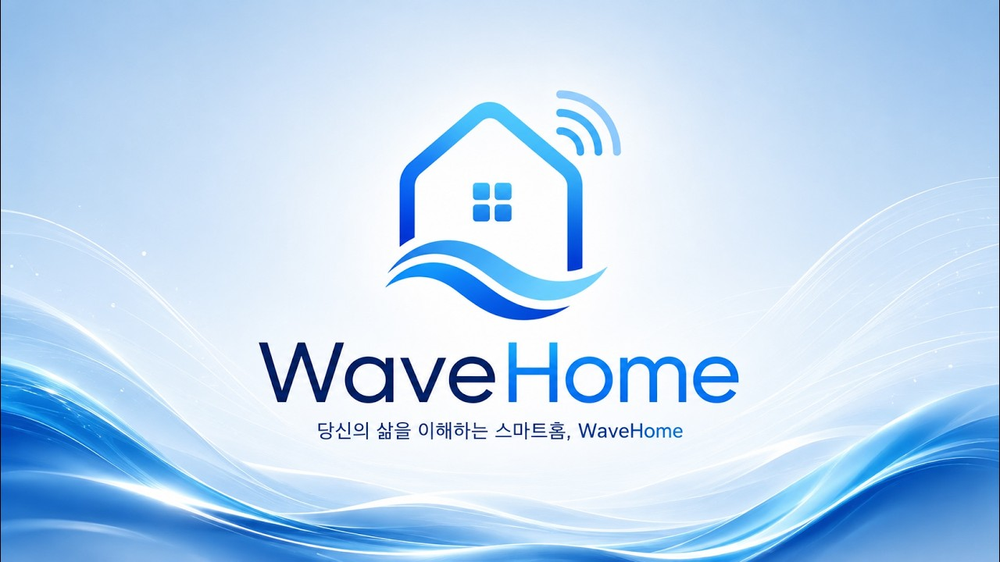

# WaveHome



서강대학교 팀 **RADAI** - 2026 AI·SW 중심대학 디지털 경진대회(SW 부문)

스마트 홈을 넘어 이제 케어 홈으로, **당신의 삶을 이해하는 홈 케어 솔루션 WaveHome**입니다.

아래의 핵심 기능에서

1. 비접촉 레이더·Wave Station으로 수면·바이탈·환경을 수집
2. 스마트 플러그에서 개별 기기 전력 소모를 추적
3. 각종 IoT 가전을 제스처·예약·룰로 제어

멀티 에이전트(수면·전력·환경 + 총괄)가 채팅, 리포트, 원클릭 인사이트를 제공합니다.

## 빠른 시작

아래는 macOS 기준입니다. Linux도 동일한 스크립트를 쓰나, 빌드를 보장하지 않습니다. 우선 3가지 빌드에 대해서 설명하겠습니다.

1. 프로덕션: 실제 기기와 연결하여 사용 가능한 빌드입니다.
2. 데모: 실제 기기와 연결하지 않고, 프론트에 데모 용 트윈 홈을 제공하여, 간접적으로 기기를 제어할 수 있습니다.
3. 테스트: 백엔드 서버는 단순히 프론트를 정적 호스팅하고, 프론트는 목업 API를 사용하는 테스트 빌드입니다.

### 0. 사전 준비


| 항목                                | 용도                                           |
| --------------------------------- | -------------------------------------------- |
| Git                               | 클론·서브모듈                                      |
| CMake 3.16+, C++20 컴파일러           | `wave-server`                                |
| Homebrew `cmake`, `libomp`        | macOS 빌드 (`scripts/build/server.sh`가 없으면 설치) |
| Node.js + npm                     | 프론트 (`wave-home-front`)                      |
| Python 3.12+                      | 에이전트 (`wave-home-agent`)                     |
| (선택) [Ollama](https://ollama.com) | `/llm/v1` 포워딩·임베딩                            |
| (선택) Gemini/OpenAI API 키          | 채팅·리포트 LLM                                   |


### 1. 클론·서브모듈

아래 명령어로 서브모듈과 함께 클론합니다.

```bash
git clone --recurse-submodules https://github.com/sogang-radai/wave-home2.git
cd wave-home2
```

이미 클론했다면 서브모듈을 클론하기 위해 다음 명령어를 입력합니다.

```bash
git submodule update --init --recursive
```


### 2. 에이전트 개발 환경 (최초 1회)

```bash
./scripts/configure/agent-dev.sh
```

`wave-home-agent/.env`가 없으면 `.env.example`에서 복사하고, Python venv·의존성까지 설치합니다.
채팅·리포트를 쓰려면 `.env`에 API 키(또는 Ollama)를 넣습니다.

```bash
# wave-home-agent/.env (발췌)
LLM_PROVIDER=gemini                 # 또는 openai / ollama
GEMINI_API_KEY=...                  # LLM_PROVIDER=gemini 일 때
# OPENAI_API_KEY=...                # LLM_PROVIDER=openai 일 때
OLLAMA_BASE_URL=http://127.0.0.1:11434   # 임베딩·LLM 포워딩 시
```

이후 에이전트 실행 전에 `source wave-home-agent/.venv/bin/activate` 하면 됩니다.


### 3. 백엔드·프론트 빌드 (세 프로필 공통)

```bash
./scripts/build/server.sh        # → bin/wave-server (drogon 로컬 패치 포함)
./scripts/build/site.sh          # production → site/
./scripts/build/site-demo.sh     # demo        → site-demo/
./scripts/build/site-test.sh     # test/mock   → site-test/
```

필요한 프로필의 site 스크립트만 실행해도 됩니다. 예: 데모만 쓸 때 `server.sh` + `site-demo.sh`.


### 4. (선택 사항) 신경망 모델 다운로드

수면·제스처 모델은 저장소에 포함되어 있습니다.
TTS/STT 가중치는 `.gitignore` 대상이므로, 음성 기능을 쓰려면 아래를 실행합니다.

```bash
./scripts/download/all-models.sh   # 또는 tts-model.sh / stt-model.sh 개별
```


### 5. 실행

세 프로필은 **동시에 띄우지 마세요** (포트·에이전트 `.env`가 겹칩니다).
프로필을 바꿀 때마다 백엔드·에이전트를 해당 포트에 맞게 다시 기동합니다.
`prod.sh` / `demo.sh`는 기동 전에 에이전트 `.env` 포트를 맞춰 줍니다 (`agent-real.sh` / `agent-demo.sh`).


| 프로필            | 프론트 정적       | Backend client | Backend agent-api | Agent    | DB                              |
| -------------- | ------------ | -------------- | ----------------- | -------- | ------------------------------- |
| **Production** | `site/`      | **8500**       | **8501**          | **8502** | `bin/data/database.db` (없으면 생성) |
| **Demo**       | `site-demo/` | **8510**       | **8511**          | **8512** | `bin/data/demo.db` (저장소 포함)     |
| **Test**       | `site-test/` | **8520**       | 미사용               | 미사용      | 인브라우저 mock (에이전트 불필요)           |


#### Production (실제 기기·DB)

터미널 1 — 백엔드:

```bash
./scripts/run/prod.sh
# 또는 ./scripts/run-prod.sh
```

터미널 2 — 에이전트:

```bash
cd wave-home-agent
source .venv/bin/activate
uvicorn app.main:app --reload --host 127.0.0.1 --port 8502
```

브라우저: [http://127.0.0.1:8500](http://127.0.0.1:8500)

#### Demo (가상 기기, `bin/data/demo.db`)

```bash
./scripts/run/demo.sh
# 또는 ./scripts/run-demo.sh
```

```bash
cd wave-home-agent
source .venv/bin/activate
uvicorn app.main:app --reload --host 127.0.0.1 --port 8512
```

브라우저: [http://127.0.0.1:8510](http://127.0.0.1:8510)

#### Test (프론트 mock, 에이전트 없음)

```bash
./scripts/run/test.sh
# 또는 ./scripts/run-test.sh
```

브라우저: [http://127.0.0.1:8520](http://127.0.0.1:8520)

---


## 폴더 구조

저장소에서 자주 보는 경로만 정리했습니다. `[ignore]`는 git에 올리지 않는 빌드·다운로드 산출물입니다.

```text
wave-home2/
├── README.md, LICENSE, CMakeLists.txt
│
├── docs/                               # 설계·API·스키마 문서 (아래 상세)
├── scripts/                            # 빌드, 실행, 설정, 모델 다운로드
│   ├── build/                          # server, site, site-demo, site-test
│   ├── run/                            # prod, demo, test (루트 run-*.sh 래퍼도 동일)
│   ├── configure/                      # 에이전트 .env (real / demo / 최초 설치)
│   ├── download/                       # TTS, STT, pose 모델
│   └── ollama/                         # 로컬 Ollama 헬퍼
│
├── src/
│   ├── wave-server/                    # C++ 백엔드 (HTTP, DB, 장치, 수면·전력 서비스)
│   ├── common/                         # 공용 유틸
│   ├── r4sn/                           # 레이더 펌웨어, iq-server
│   └── test/                           # 장치·모델 단독 테스트
│
├── bin/                                # 실행 작업 디렉터리 (여기서 wave-server 기동)
│   ├── wave-server                     # [ignore] 빌드 바이너리
│   ├── config.json                     # real / demo / test 프로필, 포트
│   ├── data/                           # DB, 장치 목록 (database.db는 [ignore], demo.db는 포함)
│   ├── models/                         # 수면 모델 포함, TTS/STT 가중치는 [ignore]
│   ├── gestures/                       # 제스처 세트 정의
│   └── device/                         # 장치 관련 런타임 파일
│
├── demo/                               # 데모 DB(demo.db) 생성 파이프라인
│   ├── scripts/                        # 01~05 데이터 생성, 에이전트 리포트, 임베딩
│   └── demo.md, sleep.md, power.md
│
├── sleep-net/                          # 수면 인식 학습·전처리·ncnn export
├── gesture-net/                        # 제스처 인식 학습·전처리·export
│
├── wave-home-front/                    # [submodule] React 프론트
├── wave-home-agent/                    # [submodule] FastAPI + LangGraph 에이전트
│
├── site/, site-demo/, site-test/       # [ignore] 프론트 빌드 결과
├── build/                              # [ignore] CMake 빌드 트리
├── cmake/                              # CMake 모듈, 의존성
└── thirdparty/                         # drogon, ncnn, sherpa-onnx, asio 등
```


### `docs/` 안내

여기서는 docs/의 문서만 설명합니다.

**시작·연동**


| 문서                                                          | 내용                                          |
| ----------------------------------------------------------- | ------------------------------------------- |
| [ports.txt](docs/ports.txt)                                 | 서버 프로파일(production, demo, test)별 포트 기준표     |
| [agent-integration.md](docs/agent-integration.md)           | 백엔드와 에이전트를 같이 띄우는 방법, `.env`, 스모크 curl      |
| [wave-server-boundaries.md](docs/wave-server-boundaries.md) | `/api/v1`(프론트), `/internal/v1`(에이전트), 데모 규칙 |


**데이터·코드 스타일**


| 문서                                              | 내용                               |
| ----------------------------------------------- | -------------------------------- |
| [db-schema.md](docs/db-schema.md)               | SQLite 테이블 (수면, 전력, 채팅, 룰, 알람 등) |
| [sleep_management.md](docs/sleep_management.md) | 수면 수집, 집계, 세션 처리 개요              |
| [power_management.md](docs/power_management.md) | 전력 미터링, 집계 스케줄 개요                |
| [style.md](docs/style.md)                       | C++ / 프로젝트 코드 스타일                |


**백엔드 ↔ 에이전트 API** ([agent-api/README.md](docs/agent-api/README.md)가 목차)


| 문서                                                                        | 내용            |
| ------------------------------------------------------------------------- | ------------- |
| [chat-api.md](docs/agent-api/chat-api.md)                                 | 채팅 턴 (SSE)    |
| [forwarding-api.md](docs/agent-api/forwarding-api.md)                     | LLM, 임베딩 포워딩  |
| [sleep-analysis-api.md](docs/agent-api/sleep-analysis-api.md)             | 수면 요약·리포트 job |
| [power-analysis-api.md](docs/agent-api/power-analysis-api.md)             | 전력 리포트 job    |
| [insight-generation-api.md](docs/agent-api/insight-generation-api.md)     | 인사이트 배치       |
| [weekly-plan-analysis-api.md](docs/agent-api/weekly-plan-analysis-api.md) | 주간 계획 배너      |
| [posture-analysis-api.md](docs/agent-api/posture-analysis-api.md)         | 자세 분석 (예약)    |
| [device-tool-api.md](docs/agent-api/device-tool-api.md)                   | 장치, 룰 등 내부 툴  |
| [alarms-api.md](docs/agent-api/alarms-api.md)                             | 알람 CRUD       |
| [schedule-tasks-api.md](docs/agent-api/schedule-tasks-api.md)             | 일정 CRUD       |
| [db-query-api.md](docs/agent-api/db-query-api.md)                         | 배치 DB 조회      |
| [rag-api.md](docs/agent-api/rag-api.md)                                   | 벡터 RAG 검색     |


**하드웨어·기타**


| 문서                                                                           | 내용                     |
| ---------------------------------------------------------------------------- | ---------------------- |
| [wave-station-protocol.md](docs/wave-station/wave-station-protocol.md)       | Wave Station TCP 프로토콜  |
| [wave-station-esp32-guide.md](docs/wave-station/wave-station-esp32-guide.md) | ESP32 펌웨어와 백엔드 연동      |
| [images/](docs/images/)                                                      | 문서용 이미지, 다이어그램         |
| `ppt/`                                                                       | 발표 자료 (로컬, git ignore) |


---

