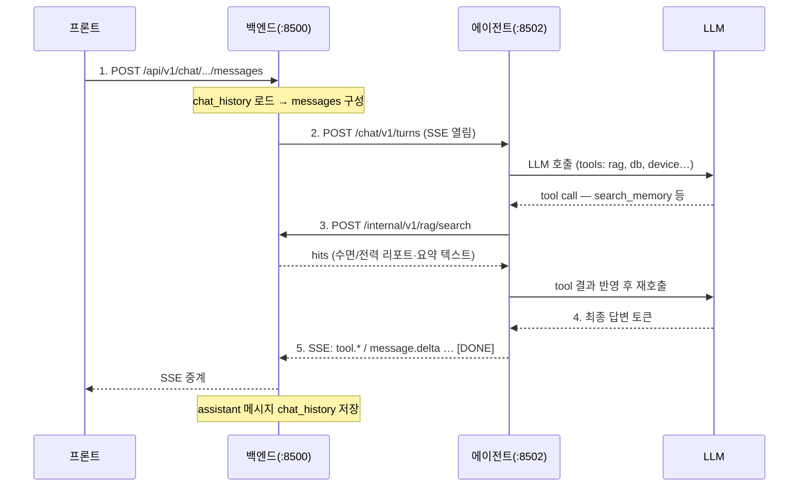

# 대화 (Chat) API

호출 방향: **백엔드(:8500) → 에이전트(:8502)** · Base URL: `/chat/v1`


에이전트 서버가 제공하는 **에이전틱 대화 API**다. 백엔드가 한 번의 대화 턴을 요청하면, 에이전트가
LangGraph 로 돌며 **필요할 때** 백엔드에 RAG·DB 조회·기기 제어 등을 tool 로 요청하고, 최종 답변을 **SSE** 로
스트리밍한다.

**기본 흐름**(권장):

1. 프론트 → 백엔드: 채팅 메시지 수신
2. 백엔드 → 에이전트: `POST /chat/v1/turns` (`messages` + `userId` 등. **RAG 결과는 아직 없음**)
3. 에이전트(LangGraph): LLM 이 필요하다고 판단 → `POST /internal/v1/rag/search` 등 **tool 호출**
4. 백엔드: RAG 수행 후 결과 반환
5. 에이전트: 수신 스니펫 + 대화로 답변 생성 → SSE 스트림
6. 백엔드: SSE 수신 → 프론트 표시 + `chat_history` 저장

호출 방향: **백엔드(:8500) → 에이전트(:8502)** (단, 3단계 tool 은 에이전트 → 백엔드)

한 턴에서 커넥션은 2종류가 동시에 열린다.

- **백엔드 → 에이전트 (긴 SSE 1개)**: 턴 실행 요청이자 토큰을 되돌려받는 채널.
- **에이전트 → 백엔드 (짧은 동기 HTTP 여러 개)**: LangGraph 가 tool 을 부를 때마다 나가는 별개 요청.
- 두 커넥션은 독립적이라 데드락이 없다. 백엔드는 SSE 를 흘리는 중에도 다른 스레드로 tool 요청을 처리한다.




### 공통

- Base URL: `/chat/v1` (에이전트 서버, `http://<agent>:8502/chat/v1`)
- 대화는 실시간이라 리포트/요약과 달리 **SSE** 를 쓴다(잡 패턴 아님).
- **LLM 호출은 에이전트가 직접** 수행한다(Ollama 로컬 모델, OpenAI 호환 외부 API 등). `/llm/v1` 포워딩 API 를
  거치지 않는다. 백엔드가 쓰는 LLM 포워딩과 챗 턴 LLM 은 별개 경로다.
- 대화 기록(`chat_history`)은 백엔드가 소유·저장한다. `chatHistoryId` 는 `chat_history.id`(INTEGER)와 1:1이다.
  에이전트는 요청으로 받은 `messages` 로만 판단하고 DB 에 쓰지 않는다.
- `model`(옵션): 요청은 선호일 뿐 에이전트가 유연하게 선택하고, 실제 사용 모델을
  `message.completed` 이벤트의 `model` 로 돌려준다.
- `context.now`(옵션): 현재 시각. 백엔드가 넣어 주면 “어제”·“오늘 밤” 해석에 사용.
- `context.retrieved`(옵션, **사전검색**): RAG 를 **턴 시작 전** 백엔드가 미리 호출해 넣는 스니펫.
  **기본 흐름(위 1~6)에서는 사용하지 않는다.** 에이전트가 턴 중 `POST /internal/v1/rag/search` tool 로 가져오는 것이
  정식 경로다. 사전검색은 latency 줄이기·항상 같은 컨텍스트 주입 같은 **최적화**용.
  넣을 경우 RAG `hits` 를 `{ collection, refId?, text }[]` 로 평탄화한다.
  RAG 대상(`vec_*`)은 3종뿐:
  - `sleep_report` — 일/주간 수면 리포트 본문
  - `sleep_stat` — 30m 수면 요약(`summary_text`)
  - `power_report` — 전력 리포트 본문
  raw 통계·인사이트 등은 벡터 없음 → RAG/`retrieved` 불가(DB 조회 tool 사용).
- 공통 에러 응답: `{ "error": { "code": "...", "message": "..." } }`


### 타입

```ts
type ChatTurnRequest = {
  chatHistoryId: number;    // chat_history.id
  userId: number;
  messages: { role: 'system' | 'user' | 'assistant'; content: string }[];
  context?: {
    now?: string;   // 'YYYY-MM-DD HH:MM:SS'
    retrieved?: { collection: string; refId?: number; text: string }[];
  };
  model?: string;
  stream?: boolean;   // 기본 true
};

// SSE 이벤트 (data: <json>\n\n)
type ChatStreamEvent =
  | { type: 'tool.start'; id?: string; name: string; args: object }
  | { type: 'tool.end'; id?: string; name: string; ok: boolean; result?: object }
  | { type: 'message.delta'; content?: string; reasoning?: string }
  | { type: 'message.completed'; content: string; model: string };
```

`tool.start` / `tool.end` 의 `id` 는 LangGraph tool run id 이다. 동일 `name` 이 한 턴에 여러 번 호출될 수 있으므로(예: `query_device` 병렬/연속), 클라이언트가 진행 표시를 갱신할 때는 **`id`로 매칭**해야 한다. `id`가 없으면 `tool.start`는 항상 새 항목으로 추가하고, `tool.end`는 같은 `name` 중 아직 `running`인 첫 항목을 갱신한다.


### POST `/turns`

대화 턴을 실행한다. `stream=true`(기본)면 **SSE**, `false`면 단일 JSON(`message.completed` 페이로드)을 반환한다.

**Request Body**

```json
{
  "chatHistoryId": 42,
  "userId": 1,
  "messages": [
    { "role": "user", "content": "거실 너무 더운데 에어컨 켜줘" }
  ],
  "context": { "now": "2026-07-04 03:10:00" },
  "stream": true
}
```

**Response 200 (SSE)**

헤더:

```http
Content-Type: text/event-stream
Cache-Control: no-cache
Connection: keep-alive
```

본문 예시:

```text
data: {"type":"tool.start","id":"a1b2c3d4-e5f6-7890-abcd-ef1234567890","name":"control_device","args":{"room":"거실","appliance":"aircon","action":"on"}}

data: {"type":"tool.end","id":"a1b2c3d4-e5f6-7890-abcd-ef1234567890","name":"control_device","ok":true,"result":{"temperature":26}}

data: {"type":"message.delta","content":"거실 "}

data: {"type":"message.delta","content":"에어컨을 켰어요."}

data: {"type":"message.completed","content":"거실 에어컨을 켰어요. 현재 28℃라 26℃로 맞췄어요.","model":"gemma4:12b-mlx"}

data: [DONE]
```

스트리밍 규칙:

- 각 이벤트는 `data: <json>\n\n` 형식이다.
- `message.delta.content` 를 누적하면 최종 답변이 된다. `tool.start`/`tool.end` 는 진행 표시용이다. 동일 도구가 여러 번 호출되면 `id`로 한 호출을 구분한다.
- thinking 모델은 `message.delta.reasoning` 으로 추론 구간을 별도 전송한다.
- 종료는 반드시 `data: [DONE]\n\n` 으로 마무리한다.
- 스트림 시작 후 오류는 `data: {"type":"error","error":{...}}\n\n` 을 보낸 뒤 연결을 닫는다.
- 백엔드가 연결을 끊으면 에이전트는 진행 중인 그래프 실행을 취소한다.

**Response 400**

```json
{
  "error": {
    "code": "INVALID_REQUEST",
    "message": "messages 는 최소 1개 이상이어야 합니다.",
    "field": "messages"
  }
}
```


### 전체 엔드포인트 요약

```http
POST /chat/v1/turns
```


### 백엔드 연동 지점

- 프론트 메시지 수신 → `chat_history` 로드 → **`messages`만** 구성해 `/chat/v1/turns` 호출(RAG 는 에이전트 tool).
- `context.now` 정도만 넣고, `context.retrieved` 는 기본적으로 **비운다**.
- SSE 를 프론트로 그대로 중계하거나(스트리밍 UX), 완성본만 모아 단일 응답으로 돌려준다.
- 완성된 assistant 메시지는 백엔드가 `chat_history.message` json 에 append 후 저장한다.
- 턴 도중 `tool.*` 는 실제로는 에이전트가 백엔드 tool API 를 호출한 결과다(아래 에이전트→백엔드 참고).

