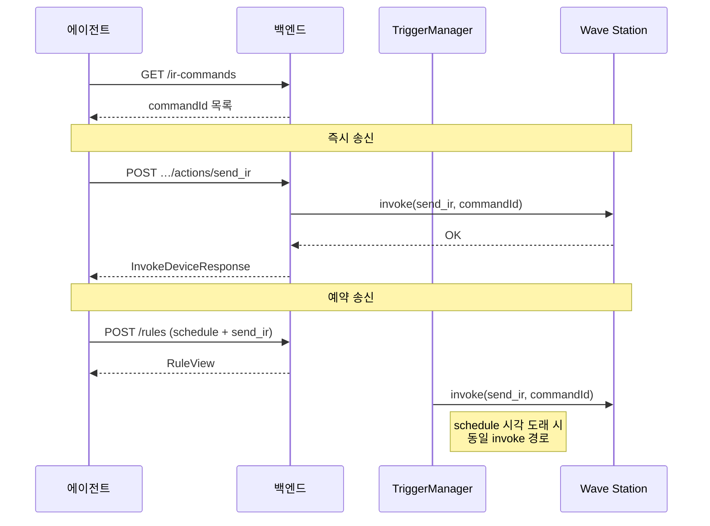

# Device Tool API

호출 방향: **에이전트(:8501) → 백엔드(:8500)** · Base URL: `/internal/v1`

에이전트가 **장치 목록·기능(capability)·실시간 상태 조회**, **동작 실행**, **자동화 룰·예약 관리**를
백엔드에 위임하는 API.

> **프론트 룰 API와 분리**: 웹 UI 는 `/api/v1/iot/rules` (wave-server `RulesController`).
> 이 문서는 **에이전트(:8501) → 백엔드(:8500)** 용 `/internal/v1/*` 이다. 스키마(Rule 모델)는 동일.
>
> **구현 상태 (2026-07-08)**: wave-server 에는 `/api/v1/iot/*` 가 구현되어 있고, `/internal/v1/*` 는 **본 문서 스펙**이다.
> 장치 조회·제어·쿼리·카메라 보조 API는 프론트 경로와 1:1 대응하며, HTTP 메서드만 다를 수 있다(예: 프론트 query 는 `GET`, internal 은 `POST`).
> 룰·예약·고수준 `tools/device.*`·IR 조회·이벤트 internal 엔드포인트는 **미구현**(프론트 룰 API·장치 `actions/send_ir` 는 `/api/v1/iot` 에 구현).

DB 배치 조회는 [db-query-api.md](./db-query-api.md), 벡터 검색은 [rag-api.md](./rag-api.md) 를 사용한다.

### 설계 원칙

1. **장치 런타임 모델 일치** — `device.h` 의 `Queryable` / `Actionable` 과 동일한 개념을 쓴다.
  - `actions[]`: 실행 가능한 동작 (`name`, `attributes`, `paramsSchema`)
  - `queries[]`: 조회 가능한 상태 (`name`, `paramsSchema`)
  - `attributes`: `Toggle` | `Repeat` | `Momentary` | `Stateful` (`Action::Attribute` 비트 플래그)
  - `Momentary` 는 룰 엔진(홀드 트리거) 전용이며 REST `execMode` 로는 노출하지 않는다.
2. **룰·예약 통합** — SQLite `automation_rule` 과 동일한 **Rule** 모델 하나로 자동화(trigger)와 예약(schedule)을 모두 표현한다.
  - `trigger` 만 있으면 자동화, `schedule` 만 있으면 예약, 둘 다 없으면 무효.
3. **장치 ID** — 런타임 API는 `device_list.json` 과 동일한 **16자리 소문자 hex 문자열**을 쓴다
  (`deviceIDToString` / `parseDeviceID`). DB `device.id`(INTEGER)와 1:1 대응한다.
4. **에이전트 편의 레이어** — LLM 툴은 `roomId` + 장치 이름으로 해석하는 고수준 API(`tools/device.*`)를 쓰고,
  내부적으로는 아래 REST를 호출한다. 방·장치 이름 → id 해석은 `device_room_map` + `device` 테이블(`POST /internal/v1/db/query`)을 쓴다.
5. **DB 조회와 역할 분리** — 등록 메타·과거 로그 배치 조회는 기존 `POST /internal/v1/db/query` 를 쓴다.
  이 API는 **실시간 제어·상태·룰 실행** 전용이다.
6. **필드명 통일** — 요청·응답 모두 `device` / `params` 를 쓴다(`appliance`, `props` 사용 안 함).


### 공통

- Base URL: `/internal/v1` (`http://<backend>:8500/internal/v1`)
- **문서 표기**: 아래 섹션 제목·예시·요약은 모두 **full path** (`/internal/v1/...`) 를 쓴다.
- Content-Type: `application/json`
- 타임아웃 권장: 제어·조회 **5s**, 룰 CRUD **3s**
- 공통 에러: `{ "error": { "code": "...", "message": "...", "field"?: "..." } }`
- 성공 응답의 장치·룰·이벤트 필드명은 **camelCase** (`POST /internal/v1/db/query` 와 동일)
- 전체 action/query 목록의 source of truth: `GET /internal/v1/device-classes` (아래 클래스별 예시는 대표 샘플)

**공통 에러 코드**


| code                | HTTP | 설명                                           |
| ------------------- | ---- | -------------------------------------------- |
| `INVALID_REQUEST`   | 400  | Body/필드 형식 오류                                |
| `INVALID_PARAMS`    | 400  | `params` 가 `paramsSchema` 와 불일치 (`field` 포함) |
| `NOT_FOUND`         | 404  | 장치·룰·IR 커맨드 없음                               |
| `AMBIGUOUS_DEVICE`  | 409  | `roomId` 범위에서 장치 이름 부분 일치가 2건 이상             |
| `DEVICE_OFFLINE`    | 409  | 장치 미연결 (state/query/invoke 공통)               |
| `ACTION_NOT_FOUND`  | 404  | 해당 클래스에 없는 action                            |
| `QUERY_NOT_FOUND`   | 404  | 해당 클래스에 없는 query                             |
| `INVALID_EXEC_MODE` | 400  | action attribute 와 맞지 않는 execMode            |
| `RULE_DISABLED`     | 409  | 비활성 룰 실행 시도                                  |
| `COOLDOWN_ACTIVE`   | 409  | 룰 쿨다운 중 (수동 실행 시)                            |
| `DEVICE_TIMEOUT`    | 504  | 장치 응답 시간 초과                                  |


---


### 타입

```ts
// ── 장치 ──────────────────────────────────────────────────────────────────

type DeviceId = string;   // 16자리 hex, 예: "5d0a3f8c26b91e74"

type ActionAttribute = 'Toggle' | 'Repeat' | 'Momentary' | 'Stateful';

type DeviceAction = {
  name: string;
  description: string;
  attributes: ActionAttribute[];
  paramsSchema: object;
};

type DeviceQuery = {
  name: string;
  description: string;
  paramsSchema?: object;
};

type DeviceClassCapabilities = {
  class: string;
  label: string;
  actions: DeviceAction[];
  queries: DeviceQuery[];
  triggerKinds: ('gesture' | 'device_state' | 'ir_recv')[];
  triggerableQueries?: string[];
  ptz?: boolean;
};

type DeviceSummary = {
  id: DeviceId;
  name: string;
  description: string;
  class: string;
  classLabel: string;
  vendor?: string;
  model?: string;
  enabled: boolean;
  connected: boolean;
  lastSeenAt?: string;
  stateSummary: string;
  room?: { id: number; name: string };
};

type DeviceDetail = DeviceSummary & {
  capabilities: DeviceClassCapabilities;
};

// ── 실행 ──────────────────────────────────────────────────────────────────

type ExecMode = 'once' | 'repeat' | 'toggle';

type InvokeDeviceRequest = {
  params?: object;
  execMode?: ExecMode;
  repeatIntervalMs?: number;
  triggeredBy?: string;
};

type InvokeDeviceResponse = {
  ok: true;
  deviceId: DeviceId;
  action: string;
  state: object;
  eventId: string;
};

type QueryDeviceRequest = {
  params?: object;
};

type QueryDeviceResponse = {
  deviceId: DeviceId;
  query: string;
  result: object;
};

// ── 룰·예약 ───────────────────────────────────────────────────────────────

type TriggerKind = 'gesture' | 'device_state' | 'ir_recv';

type GestureTrigger = {
  kind: 'gesture';
  deviceId: DeviceId;
  gestureSetPath: string;
  classId: number;
};

type DeviceStateTrigger = {
  kind: 'device_state';
  deviceId: DeviceId;
  query: string;
  op: '>' | '>=' | '<' | '<=' | '==';
  value: number;
};

type IrRecvTrigger = {
  kind: 'ir_recv';
  deviceId: DeviceId;
  commandId: string;
};

type RuleTrigger = GestureTrigger | DeviceStateTrigger | IrRecvTrigger;

type ScheduleOnce = {
  repeat: 'once';
  delayMinutes: number;
};

type ScheduleDaily = {
  repeat: 'daily';
  time: string;
};

type ScheduleWeekly = {
  repeat: 'weekly';
  time: string;
  daysOfWeek: ('mon'|'tue'|'wed'|'thu'|'fri'|'sat'|'sun')[];
};

type RuleSchedule = ScheduleOnce | ScheduleDaily | ScheduleWeekly;

type RuleAction = {
  deviceId: DeviceId;
  name: string;
  params?: object;
};

type Rule = {
  id: string;
  name: string;
  enabled: boolean;
  trigger: RuleTrigger | null;
  schedule: RuleSchedule | null;
  action: RuleAction;
  execMode: ExecMode;
  repeatIntervalMs?: number;
  cooldownMs: number;
};

type RuleView = Rule & {
  actionDeviceName: string;
  triggerDeviceName?: string;
};

type CreateRuleRequest = Omit<Rule, 'id'>;
type UpdateRuleRequest = Partial<CreateRuleRequest>;

// ── IR · 이벤트 ───────────────────────────────────────────────────────────

type IrCommand = {
  id: string;
  name: string;
  description?: string;
  deviceHint?: string;
  unit: 'us';
  timings: number[];
  source: 'learned' | 'manual';
  createdAt: string;
};

type DeviceEventType = 'connection' | 'gesture' | 'ir' | 'execution' | 'schedule';

type DeviceEvent = {
  id: string;
  type: DeviceEventType;
  occurredAt: string;
  deviceId: DeviceId | null;
  deviceName: string | null;
  message: string;
  triggeredBy: string | null;
  detail: object;
};

// ── 고수준 툴 (LLM용) ─────────────────────────────────────────────────────

type DeviceListToolRequest = {
  userId?: number;
  roomId?: number;
};

type DeviceControlToolRequest = {
  userId?: number;
  roomId: number;
  device: string;
  action: string;
  params?: object;
  execMode?: ExecMode;
};

type DeviceQueryToolRequest = {
  userId?: number;
  roomId: number;
  device: string;
  query: string;
  params?: object;
};

type DeviceScheduleToolRequest = {
  userId?: number;
  roomId: number;
  device: string;
  action: string;
  params?: object;
  schedule: RuleSchedule;
  name?: string;
};

type DeviceScheduleListToolRequest = {
  userId?: number;
  roomId?: number;
  deviceId?: DeviceId;
  enabled?: boolean;
};

type DeviceScheduleCancelToolRequest = {
  userId?: number;
  ruleId: string;
};
```

---


### GET `/internal/v1/devices`

활성 장치 목록과 런타임 연결 상태를 반환한다.

**Query**


| 파라미터        | 설명                                  |
| ----------- | ----------------------------------- |
| `userId`    | 해당 사용자에 매핑된 장치만 (`device_user_map`) |
| `roomId`    | 방 필터 (`device_room_map`)            |
| `class`     | 클래스 필터, 예: `tuya_ep2h`              |
| `connected` | `true` | `false`                    |
| `enabled`   | `true`(기본) | `false`                |


**Response 200**

```json
{
  "items": [
    {
      "id": "5d0a3f8c26b91e74",
      "name": "거실 조명",
      "description": "거실 조명 - 컬러",
      "class": "philips_wiz_e29_color",
      "classLabel": "WiZ 컬러 조명",
      "vendor": "Philips",
      "model": "WiZ Color E29",
      "enabled": true,
      "connected": true,
      "lastSeenAt": "2026-07-06T10:00:05+09:00",
      "stateSummary": "켜짐 · 밝기 70%",
      "room": { "id": 2, "name": "거실" }
    }
  ],
  "count": 11
}
```

---


### GET `/internal/v1/devices/{deviceId}`

단일 장치 상세 + **capabilities** 를 반환한다.

**Response 200** — `tuya_ep2h` 예시

```json
{
  "id": "6b0f3e8a92c47d15",
  "name": "플러그1",
  "class": "tuya_ep2h",
  "classLabel": "스마트 플러그",
  "enabled": true,
  "connected": true,
  "stateSummary": "켜짐 · 27.7W",
  "room": { "id": 2, "name": "거실" },
  "capabilities": {
    "class": "tuya_ep2h",
    "label": "스마트 플러그",
    "actions": [
      { "name": "on", "description": "전원 켜기", "attributes": ["Stateful"], "paramsSchema": {} },
      { "name": "off", "description": "전원 끄기", "attributes": ["Stateful"], "paramsSchema": {} },
      { "name": "toggle", "description": "전원 토글", "attributes": ["Toggle", "Stateful"], "paramsSchema": {} }
    ],
    "queries": [
      { "name": "power", "description": "순간 전력(W)" },
      { "name": "voltage", "description": "AC 전압(V)" },
      { "name": "status", "description": "전체 datapoint" }
    ],
    "triggerKinds": ["device_state"],
    "triggerableQueries": ["power", "voltage", "current"]
  }
}
```

---


### GET `/internal/v1/device-classes`

클래스별 정적 capability 레지스트리 전체. `actions[]`·`queries[]`·`triggerKinds[]` 가 source of truth.

**Response 200** (발췌)

```json
{
  "items": [
    {
      "class": "tuya_ep2h",
      "label": "스마트 플러그",
      "actions": [
        { "name": "on", "attributes": ["Stateful"], "paramsSchema": {} },
        { "name": "off", "attributes": ["Stateful"], "paramsSchema": {} },
        { "name": "toggle", "attributes": ["Toggle", "Stateful"], "paramsSchema": {} }
      ],
      "queries": [
        { "name": "switch" }, { "name": "voltage" }, { "name": "current" },
        { "name": "power" }, { "name": "energy" }, { "name": "status" }
      ],
      "triggerKinds": ["device_state"],
      "triggerableQueries": ["power", "voltage", "current"]
    }
  ],
  "count": 8
}
```

---

## API 역량 요약

에이전트가 장치에 대해 쓸 수 있는 **4가지 축**과 대응 엔드포인트.

| 축 | 설명 | REST (internal) | LLM 고수준 툴 |
|----|------|-----------------|---------------|
| **조회** | 등록된 장치 목록·연결·capabilities | `GET /internal/v1/devices`, `GET …/{deviceId}` | `POST …/tools/device.list` |
| **쿼리** | 실시간 센서·상태 1건 | `POST …/query/{queryName}`, `GET …/state` | `POST …/tools/device.query` |
| **조작** | action 즉시 실행 | `POST …/actions/{actionName}` | `POST …/tools/device.control` |
| **예약** | 지연·반복 실행(룰 `schedule`) | `POST /internal/v1/rules`, `tools/device.schedule*` | `device.schedule`, `device.schedule.list`, `device.schedule.cancel` |

**IR** (적외선 커맨드)는 별도 축:

| | 조회 (전역) | 송신 |
|--|------------|------|
| API | `GET /internal/v1/ir-commands`, `GET …/{commandId}` | `wave_station` 의 `send_ir` action (`POST …/actions/send_ir` 또는 예약 룰) |
| 저장소 | `bin/device/ir_list.json` | Wave Station IR LED |

- `POST /internal/v1/ir-commands/{commandId}/send` 는 **정의하지 않는다**. 송신은 Wave Station 장치 action 만 사용.

- **조회**는 메타·연결 상태. **쿼리**는 장치 프로토콜로 값을 읽는 것(전력 W, 밝기 % 등).
- **예약**은 `automation_rule` 에 `schedule` 만 있는 룰. `trigger` 가 있으면 자동화(제스처·전력 임계·IR 수신).
- `Actionable` 이 없는 클래스(`srs_r4sn`, `reolink_e1_pro`, `droid_cam`)는 **조작·예약 action 대상이 아님**. 카메라는 스트림·PTZ·TTS 보조 API 사용.

### 프론트(`/api/v1/iot`) 대응

| internal | 프론트 (구현됨) | 비고 |
|----------|----------------|------|
| `GET /internal/v1/devices` | `GET /api/v1/iot/devices` | |
| `POST …/query/{name}` | `GET /api/v1/iot/devices/{id}/query/{name}` | 메서드만 다름 |
| `POST …/actions/{name}` | `POST /api/v1/iot/devices/{id}/actions/{name}` | |
| `GET …/state` | `GET /api/v1/iot/devices/{id}/state` | |
| PTZ·stream·snapshot·TTS | 동일 path under `/api/v1/iot/devices/{id}/…` | |
| `GET /internal/v1/ir-commands` | `GET /api/v1/iot/ir-commands` (mock·스펙) | **조회만** 전역 |
| IR 송신 | `POST /api/v1/iot/devices/{waveStationId}/actions/send_ir` | Wave Station action |
| 룰·예약·events·tools | — | internal 전용(룰만 `/api/v1/iot/rules`) |

---

## 장치 클래스 개요

`bin/device/device_list.json` 기준 **8종**. 상세 action·query·params 는 아래 [클래스별 레퍼런스](#클래스별-레퍼런스) 참고.

| class | 라벨 | 조회 | 쿼리 | 조작 | 예약 | 트리거 |
|-------|------|:--:|:--:|:--:|:--:|:------|
| `tuya_ep2h` | 스마트 플러그 | ✓ | ✓ | on/off/toggle | ✓ | `device_state` (power, voltage, current) |
| `philips_wiz_e29_color` | WiZ 컬러 조명 | ✓ | ✓ | on/off/toggle/brightness/color | ✓ | `device_state` (brightness 등) |
| `philips_wiz_e29_white` | WiZ 화이트 조명 | ✓ | ✓ | on/off/toggle/brightness/temperature | ✓ | `device_state` |
| `samsung_g7` | Tizen TV | ✓ | ✓ | 전원·볼륨·리모컨·앱 등 | ✓ | `device_state` (제한적) |
| `wave_station` | Wave Station | ✓ | ✓ | IR 송신·스트림 구독 | ✓ (`send_ir`) | `ir_recv` |
| `reolink_e1_pro` | IoT 카메라 | ✓ | stream/status | — | — | — |
| `droid_cam` | 폰 카메라 | ✓ | stream/status | — | — | — |
| `srs_r4sn` | mmWave 레이더 | ✓ | point_cloud/iq | — | — | `gesture` |

- `samsung_g7` 은 DB·일부 코드에서 `tizen_tv` 로도 표기된다. 필터·capabilities 는 동일 취급.
- 카메라 TTS: `POST …/devices/{deviceId}/tts` (프론트 구현, internal 스펙 동일 path).

---


### GET `/internal/v1/devices/{deviceId}/state`

장치 **전체 런타임 상태** 스냅샷 (`query/status` 또는 `query/state` 와 동일).

**Response 200** — `tuya_ep2h`

```json
{
  "deviceId": "6b0f3e8a92c47d15",
  "connected": true,
  "state": {
    "switch": true,
    "voltage": 234.6,
    "current": 118.2,
    "power": 27.7,
    "energy": 12.4
  }
}
```

**Response 409** — `DEVICE_OFFLINE`

---


### POST `/internal/v1/devices/{deviceId}/query/{queryName}`

특정 query 하나를 실행한다. `actions/{actionName}` 과 동일하게 **이름은 path**, 파라미터는 body.

**Request Body**

```json
{
  "params": {}
}
```

**Response 200**

```json
{
  "deviceId": "6b0f3e8a92c47d15",
  "query": "power",
  "result": { "power": 27.7 }
}
```

`queryName` 이 `status` 또는 `state` 이면 클래스 전체 상태 객체를 `result` 에 담는다.

---


### POST `/internal/v1/devices/{deviceId}/actions/{actionName}`

장치 동작 실행. 백엔드는 `Actionable::invoke(name, params)` 호출 후 `device_event` 기록.

**Request Body**

```json
{
  "params": { "value": 20 },
  "execMode": "once",
  "triggeredBy": "agent:manual"
}
```

**Response 200**

```json
{
  "ok": true,
  "deviceId": "5d0a3f8c26b91e74",
  "action": "brightness",
  "state": { "on": true, "brightness": 20, "color": { "r": 255, "g": 196, "b": 120 } },
  "eventId": "evt_20260706100512ab3c"
}
```

**execMode 검증**


| execMode | 필요 attribute | 용도                                   |
| -------- | ------------ | ------------------------------------ |
| `once`   | (없음)         | 1회 실행                                |
| `toggle` | `Toggle`     | on/off 토글                            |
| `repeat` | `Repeat`     | 홀드 중 반복 (`repeatIntervalMs`, 기본 200) |


---


### 클래스별 레퍼런스

아래는 `device.h` `Actionable`/`Queryable` 구현과 동일한 계약이다.
예약 가능 action 은 `execMode: "once"` 로 `POST /internal/v1/rules` 또는 `tools/device.schedule` 에 넣을 수 있다.

#### `tuya_ep2h` — 스마트 플러그

| 구분 | 이름 | attribute | params | 설명 |
|------|------|-----------|--------|------|
| action | `on` | Stateful | — | 전원 ON |
| action | `off` | Stateful | — | 전원 OFF |
| action | `toggle` | Toggle, Stateful | — | 전원 토글 |
| query | `switch` | — | — | ON/OFF |
| query | `voltage` | — | — | AC 전압(V) |
| query | `current` | — | — | 전류(mA) |
| query | `power` | — | — | 순간 전력(W) |
| query | `energy` | — | — | 누적 에너지(kWh, 지원 시) |
| query | `status` | — | — | 전체 datapoint |

**트리거**: `device_state` — `query` = `power` \| `voltage` \| `current`, `op` + `value` 비교.

```http
POST /internal/v1/devices/6b0f3e8a92c47d15/actions/on
POST /internal/v1/devices/6b0f3e8a92c47d15/actions/toggle     { "execMode": "toggle" }
POST /internal/v1/devices/6b0f3e8a92c47d15/query/power
```

**예약 예**: 30분 뒤 OFF — `action: { name: "off" }`, `schedule: { repeat: "once", delayMinutes: 30 }`.

**state 스냅샷**: `{ switch, voltage, current, power, energy }` (camelCase 정규화).

---

#### `philips_wiz_e29_color` — WiZ 컬러 조명

| 구분 | 이름 | attribute | params | 설명 |
|------|------|-----------|--------|------|
| action | `on` / `off` / `toggle` | Stateful / Toggle | — | 전원 |
| action | `brightness` | Stateful | `{ value: 10..100 }` | 밝기 % |
| action | `color` | Stateful | `{ r, g, b: 0..255 }` | RGB |
| query | `capabilities` | — | — | color/tunable_white 플래그 |
| query | `state` | — | — | `{ on, brightness }` |
| query | `brightness` | — | — | `{ value, unit: "%" }` |
| query | `color` | — | — | `{ r, g, b }` |
| query | `status` | — | — | pilot 전체 + `raw` |

```http
POST /internal/v1/devices/5d0a3f8c26b91e74/actions/brightness
{ "params": { "value": 30 }, "execMode": "once" }

POST /internal/v1/devices/5d0a3f8c26b91e74/actions/color
{ "params": { "r": 255, "g": 120, "b": 64 }, "execMode": "once" }
```

**예약 예**: 매일 22:30 밝기 20 — `action: { name: "brightness", params: { value: 20 } }`, `schedule: { repeat: "daily", time: "22:30" }`.

---

#### `philips_wiz_e29_white` — WiZ 화이트 조명

컬러 조명과 동일하나 **`color` action/query 없음**. 대신 색온도:

| action | `temperature` | Stateful | `{ value: tempMinK..tempMaxK }` (일반 2200~6500K) |
| query | `temperature` | — | `{ value, unit: "K" }` |

`capabilities` 쿼리로 `tunable_white`, `temp_min_k`, `temp_max_k` 확인.

```http
POST /internal/v1/devices/3f7c2a9e14d8065b/actions/temperature
{ "params": { "value": 3000 }, "execMode": "once" }
```

---

#### `samsung_g7` — Tizen TV (`tizen_tv` 별칭)

런타임 클래스는 `samsung_g7`. 페어링·토큰은 `device_list.json` `interface.token`.

**공통 action**

| 이름 | attribute | params | execMode | 설명 |
|------|-----------|--------|----------|------|
| `on` / `off` / `toggle` | Stateful / Toggle | — | once / toggle | 전원 |
| `mute` | Toggle, Stateful | — | toggle | 음소거 토글 |
| `volume_up` / `volume_down` | Repeat, Stateful | — | **repeat** | 볼륨 (홀드 반복) |
| `nav_up` / `nav_down` / `nav_left` / `nav_right` | Repeat | — | once 또는 repeat | D-pad |
| `select` / `home` / `back` | Repeat | — | once | OK / 홈 / 뒤로 |
| `input_source` | Repeat | — | once | 입력 순환 |
| `play_pause` | Repeat | — | once | 재생/일시정지 |
| `send_key` | Repeat | `{ key: "KEY_*" }` | once | 원시 리모컨 키 |

**기기 capability 에 따라 추가**

| 이름 | params | 설명 |
|------|--------|------|
| `channel_up` / `channel_down` | — | 채널 (DTV 모델) |
| `input` | `{ source: "hdmi1"\|"hdmi2"\|"hdmi3"\|"hdmi4"\|"displayport"\|"dp" }` | 입력 전환 |
| `open_app` | `{ app: "netflix"\|"youtube"\|"prime_video"\|"samsung_tv_plus"\|<숫자 appId> }` | 앱 실행 |

**query**: `capabilities`, `session`, `state`, `inputs`, `input`

```http
POST /internal/v1/devices/2c9f6a1b4d78e350/actions/volume_up
{ "execMode": "repeat", "repeatIntervalMs": 200 }

POST /internal/v1/devices/2c9f6a1b4d78e350/actions/open_app
{ "params": { "app": "netflix" }, "execMode": "once" }

POST /internal/v1/devices/2c9f6a1b4d78e350/actions/mute
{ "execMode": "toggle" }
```

**state 예**: `{ on, volume, channel, muted, app }`

**예약 예**: 30분 뒤 TV OFF — `action: { name: "off" }`, `schedule: { repeat: "once", delayMinutes: 30 }`.

---

#### `wave_station` — Wave Station (IR 허브·환경·마이크)

| 구분 | 이름 | params | 설명 |
|------|------|--------|------|
| action | `send_ir` | `{ commandId: string, repeat?: number }` | `ir_list.json` 커맨드를 IR LED로 송신. `repeat` = 동일 프레임 연속 송신 횟수(기본 0) |
| action | `subscribe` | `{ target, intervalMs?, compressed?, on_change_only? }` | WSP1 스트림 구독 |
| action | `unsubscribe` | `{ target }` | 구독 해제 |
| query | `capabilities` | — | mic/speaker/IR/센서 플래그 |
| query | `session` | — | host, port, 오디오 포맷 |
| query | `status` | — | 연결·구독 상태 |
| query | `mic_level` | — | 마이크 RMS 0..1 |
| query | `env` | — | `{ lux, temperature, humidity }` |
| query | `last_ir` | — | 최근 IR 수신 + `commandId` 매칭 |

**`subscribe.target` 예**: `mic_opus`, `mic_pcm`, `ir_receive`, `ambient_light`

**트리거**: `ir_recv` — Wave Station 이 IR 을 수신·`ir_list.json` 과 매칭했을 때 `commandId` 로 룰 발화.

**즉시 송신** — Wave Station `send_ir` action (다른 경로 없음):

```http
POST /internal/v1/devices/5c1e8b6402fda973/actions/send_ir
```

```json
{
  "params": { "commandId": "ir_ac_power", "repeat": 0 },
  "execMode": "once",
  "triggeredBy": "agent:manual"
}
```

백엔드는 `RadaiWs::invoke("send_ir")` → `ir_list.json` 에서 `timings` 로드 → IR LED 송신. 연결 끊김이면 `409 DEVICE_OFFLINE`.

**예약 송신** — `automation_rule` 의 `schedule` + `action` (다른 장치와 동일). `TriggerManager` 가 발화 시 **동일** `invoke("send_ir")` 경로를 탄다. `schedule.once` 는 1회 실행 후 룰 자동 삭제.

```json
{
  "name": "30분 뒤 에어컨 전원 IR",
  "enabled": true,
  "trigger": null,
  "schedule": { "repeat": "once", "delayMinutes": 30 },
  "action": {
    "deviceId": "5c1e8b6402fda973",
    "name": "send_ir",
    "params": { "commandId": "ir_ac_power" }
  },
  "execMode": "once",
  "cooldownMs": 0
}
```

고수준 툴: `POST /internal/v1/tools/device.control` — `device: "Wave Station"`, `action: "send_ir"`, `params: { commandId }`.  
예약: `POST /internal/v1/tools/device.schedule` — 동일 action·params + `schedule`.

```http
POST /internal/v1/devices/5c1e8b6402fda973/query/env
POST /internal/v1/devices/5c1e8b6402fda973/query/last_ir
```

**후순위**: `speak` action (`{ text }`) — TTS → 스피커. 현재는 카메라와 동일하게 `POST …/tts` 보조 API 사용.

---

#### `reolink_e1_pro` — Reolink E1 Pro

표준 `Actionable` **없음**. 쿼리·보조 API 로만 제어.

| query | 설명 |
|-------|------|
| `stream` | RTSP URI (main/sub, go2rtc) |
| `status` | `{ streaming, micLevel }` |

**보조 API** (아래 [카메라 PTZ / 스트림](#카메라-ptz--스트림-reolink_e1_pro--droid_cam) 참고):

- PTZ: `ptz/move`, `ptz/stop`, `ptz/zoom`
- 스트림: `GET/PUT …/stream`, WebRTC/MJPEG/MP4
- `POST …/snapshot` — JPEG
- `POST …/tts` — `{ text, speakerId?, speed? }` (go2rtc 경유, TTS 엔진 필요)

```http
POST /internal/v1/devices/27d9a4f3c85b016e/query/status
→ { "streaming": false, "micLevel": 0.12 }

POST /internal/v1/devices/27d9a4f3c85b016e/ptz/move
{ "pan": 0.5, "tilt": -0.3 }
```

---

#### `droid_cam` — DroidCam 폰 카메라

`reolink_e1_pro` 와 유사하나 **PTZ 없음**, go2rtc 대신 HTTP MJPEG.

| query | 설명 |
|-------|------|
| `capabilities` | snapshot/stream/mic 플래그 |
| `session` | HTTP 엔드포인트 |
| `status` | 연결·스트리밍 상태 |
| `stream` | MJPEG source URI |

**보조 API**: `GET/PUT …/stream`, `POST …/snapshot`, `POST …/tts` (Reolink 와 동일 계약).

```http
POST /internal/v1/devices/a3d7c91e2f0486b5/query/status
PUT  /internal/v1/devices/a3d7c91e2f0486b5/stream
{ "streaming": true }
```

---

#### `srs_r4sn` — SRS R4SN mmWave 레이더

**조작·예약 action 없음.** 제스처 인식 파이프라인 입력 + 고대역width 분석용 쿼리.

| query | 타입 | 설명 |
|-------|------|------|
| `point_cloud` | Interface | 포인트 클라우드 스트림 |
| `iq` | Interface | IQ 샘플 (온디맨드) |

**트리거**: `gesture` — `deviceId` + `gestureSetPath` + `classId`. 과거 기록은 `gesture_log` (`db/query`).

에이전트 일반 제어 흐름에서는 **조회(`GET devices`)로 존재·연결 확인** 후, 룰 트리거 소스로만 참조. 실시간 제스처는 `GET /internal/v1/events` (`type=gesture`).

**알람 연동**: `smartWake` 레이더로 지정 (`alarm.md` — `radarDeviceId`).

---


### 카메라 PTZ / 스트림 / TTS (`reolink_e1_pro`, `droid_cam`)

`Actionable` 이 없는 카메라 클래스 전용. 프론트 `/api/v1/iot/devices/{deviceId}/…` 와 동일.

```http
GET  /internal/v1/devices/{deviceId}/ptz/capabilities   # reolink_e1_pro 만
POST /internal/v1/devices/{deviceId}/ptz/move           { "pan": -1..1, "tilt": -1..1 }
POST /internal/v1/devices/{deviceId}/ptz/stop           {}
POST /internal/v1/devices/{deviceId}/ptz/zoom           { "delta": number }
GET  /internal/v1/devices/{deviceId}/stream             → { "status": "idle"|"streaming", "url": string|null }
PUT  /internal/v1/devices/{deviceId}/stream             { "streaming": true|false }
POST /internal/v1/devices/{deviceId}/snapshot           → JPEG (헤더 `X-Snapshot-At`)
POST /internal/v1/devices/{deviceId}/tts                { "text": "...", "speakerId"?: 0, "speed"?: 1.0 }
```

| class | PTZ | go2rtc/WebRTC | MJPEG | TTS |
|-------|:---:|:-------------:|:-----:|:---:|
| `reolink_e1_pro` | ✓ | ✓ | ✓ | ✓ |
| `droid_cam` | — | — | ✓ | ✓ |

TTS 는 백엔드 TTS 엔진(`tts_service`) + 카메라 스트림 경로가 준비된 경우에만 성공. 미구축 시 `503 TTS_UNAVAILABLE`.

---


### GET `/internal/v1/rules`

**Query**: `deviceId`, `enabled`, `hasSchedule`, `hasTrigger`

**Response 200** — 예약 룰 예시

```json
{
  "items": [
    {
      "id": "rule_schedule_tv_off_once",
      "name": "30분 뒤 TV 끄기",
      "enabled": true,
      "trigger": null,
      "schedule": { "repeat": "once", "delayMinutes": 30 },
      "action": { "deviceId": "2c9f6a1b4d78e350", "name": "off", "params": {} },
      "execMode": "once",
      "cooldownMs": 0,
      "actionDeviceName": "TV",
      "triggerDeviceName": null
    }
  ],
  "count": 7
}
```

---


### POST `/internal/v1/rules`

**검증**: `trigger`·`schedule` 중 최소 하나, `action` 은 capabilities 와 일치, `schedule.once` 실행 후 룰은 **자동 삭제**.

Wave Station IR 예약 예:

```json
{
  "name": "30분 뒤 에어컨 IR",
  "enabled": true,
  "trigger": null,
  "schedule": { "repeat": "once", "delayMinutes": 30 },
  "action": {
    "deviceId": "5c1e8b6402fda973",
    "name": "send_ir",
    "params": { "commandId": "ir_ac_power" }
  },
  "execMode": "once",
  "cooldownMs": 0
}
```

**Response 201** — `RuleView`

---


### PUT `/internal/v1/rules/{ruleId}` · DELETE `/internal/v1/rules/{ruleId}` · PUT `/internal/v1/rules/{ruleId}/enabled` · POST `/internal/v1/rules/{ruleId}/execute`

예약 취소는 `DELETE /internal/v1/rules/{ruleId}`.

`POST .../execute` — `enabled: false` 이면 `409 RULE_DISABLED`, 쿨다운 중이면 `409 COOLDOWN_ACTIVE`.

---


## 적외선(IR) 커맨드

저장소: `bin/device/ir_list.json` (Wave Station `settings.ir_list_path` 로 재지정 가능).

| 역할 | API | 비고 |
|------|-----|------|
| **조회** (전역) | `GET /internal/v1/ir-commands`, `GET …/{commandId}` | 장치 id 불필요 |
| **송신** | `POST …/devices/{waveStationId}/actions/send_ir` | **Wave Station 전용**, 즉시 |
| **예약 송신** | `POST /internal/v1/rules` (`schedule` + `send_ir` action) | `TriggerManager` → 동일 `invoke` |
| **수신 트리거** | 룰 `trigger.kind: "ir_recv"` | Wave Station 수신 → `commandId` 매칭 |

`POST /internal/v1/ir-commands/{commandId}/send` 는 **없음**. 송신은 반드시 Wave Station 장치 action.

### GET `/internal/v1/ir-commands`

등록된 IR 커맨드 목록. 목록 응답에서는 `timings` 를 생략할 수 있다.

**Query** (선택): `deviceHint`, `source` (`learned` | `manual`)

**Response 200**

```json
{
  "items": [
    {
      "id": "ir_ac_power",
      "name": "에어컨 전원",
      "description": "LG 에어컨 전원 토글 (학습됨)",
      "deviceHint": "LG 에어컨",
      "unit": "us",
      "source": "learned",
      "createdAt": "2026-07-01T10:00:00+09:00"
    }
  ],
  "count": 8
}
```

### GET `/internal/v1/ir-commands/{commandId}`

단일 커맨드 상세. **`timings`** 배열 전체 포함(mark/space μs 교대).

**Response 200**

```json
{
  "id": "ir_ac_power",
  "name": "에어컨 전원",
  "unit": "us",
  "timings": [9000, 4500, 560, 560, 560, 1690, 560, 560, 560, 1690, 560, 560, 560, 1690, 560, 39000],
  "source": "learned",
  "createdAt": "2026-07-01T10:00:00+09:00"
}
```

**Response 404** — `{ "error": { "code": "NOT_FOUND", "message": "..." } }`

### 송신 흐름 (즉시 vs 예약)



- **즉시**: HTTP 요청 안에서 `invoke` 완료(장치 타임아웃 시 `504 DEVICE_TIMEOUT`).
- **예약**: `TriggerManager::tickSchedule` → `dispatchBindings` → `ActionJob` → 장치 `invoke`. `once` / `daily` / `weekly` 지원.
- `params.repeat`(0~N): 한 번의 `invoke` 안에서 동일 IR 프레임 반복 송신. `execMode: "repeat"` 와 무관.

---


### GET `/internal/v1/events`

**Query**: `types`, `deviceId`, `from`, `to`, `limit`(기본 50, 최대 200)

---


## 고수준 Tool API (LLM 바인딩용)

백엔드가 `roomId` + 장치 이름 부분 일치로 `deviceId` 를 해석한 뒤 위 REST를 호출한다.
동일 `roomId` 에 2건 이상 매칭되면 `409 AMBIGUOUS_DEVICE`.

### POST `/internal/v1/tools/device.list`

```json
{ "userId": 1, "roomId": 2 }
```

→ `GET /internal/v1/devices?userId=1&roomId=2` 요약.

**Response 200**

```json
{
  "items": [
    {
      "id": "5d0a3f8c26b91e74",
      "name": "거실 조명",
      "class": "philips_wiz_e29_color",
      "connected": true,
      "stateSummary": "켜짐 · 밝기 70%",
      "actions": ["on", "off", "toggle", "brightness", "color"]
    }
  ]
}
```

---


### POST `/internal/v1/tools/device.control`

```json
{
  "userId": 1,
  "roomId": 2,
  "device": "조명",
  "action": "brightness",
  "params": { "value": 30 },
  "execMode": "once"
}
```

**Response 200**

```json
{
  "ok": true,
  "deviceId": "5d0a3f8c26b91e74",
  "deviceName": "거실 조명",
  "action": "brightness",
  "state": { "on": true, "brightness": 30, "color": { "r": 255, "g": 196, "b": 120 } },
  "eventId": "evt_..."
}
```

---


### POST `/internal/v1/tools/device.query`

```json
{
  "userId": 1,
  "roomId": 2,
  "device": "플러그1",
  "query": "power",
  "params": {}
}
```

내부: `POST /internal/v1/devices/{deviceId}/query/power`

---


### POST `/internal/v1/tools/device.schedule`

```json
{
  "userId": 1,
  "roomId": 3,
  "device": "TV",
  "action": "off",
  "params": {},
  "schedule": { "repeat": "once", "delayMinutes": 30 },
  "name": "30분 뒤 TV 끄기"
}
```

**Response 201**

```json
{
  "ok": true,
  "rule": {
    "id": "rule_agent_20260706_100612",
    "name": "30분 뒤 TV 끄기",
    "enabled": true,
    "schedule": { "repeat": "once", "delayMinutes": 30 },
    "action": { "deviceId": "2c9f6a1b4d78e350", "name": "off", "params": {} }
  }
}
```

---


### POST `/internal/v1/tools/device.schedule.list`

등록된 **예약 룰** 목록. 내부: `GET /internal/v1/rules?hasSchedule=true` + 필터.

**Request Body**

```json
{
  "userId": 1,
  "roomId": 2,
  "enabled": true
}
```

`roomId` 가 있으면 해당 방 장치에 연결된 예약만. `deviceId` 로 특정 장치 대상만 좁힐 수 있다.

**Response 200**

```json
{
  "items": [
    {
      "id": "rule_schedule_tv_off_once",
      "name": "30분 뒤 TV 끄기",
      "enabled": true,
      "schedule": { "repeat": "once", "delayMinutes": 30 },
      "actionDeviceName": "TV",
      "action": { "deviceId": "2c9f6a1b4d78e350", "name": "off", "params": {} }
    },
    {
      "id": "rule_schedule_night_dim",
      "name": "매일 22:30 거실 조명 밝기 낮춤",
      "enabled": true,
      "schedule": { "repeat": "daily", "time": "22:30" },
      "actionDeviceName": "거실 조명",
      "action": { "deviceId": "5d0a3f8c26b91e74", "name": "brightness", "params": { "value": 20 } }
    }
  ],
  "count": 2
}
```

---


### POST `/internal/v1/tools/device.schedule.cancel`

예약 취소. 내부: `DELETE /internal/v1/rules/{ruleId}`.

**Request Body**

```json
{
  "userId": 1,
  "ruleId": "rule_schedule_tv_off_once"
}
```

**Response 200**

```json
{
  "ok": true,
  "ruleId": "rule_schedule_tv_off_once",
  "name": "30분 뒤 TV 끄기"
}
```

**Response 404** — `NOT_FOUND`

---


## 전체 엔드포인트 요약

```http
# 장치 조회
GET  /internal/v1/devices
GET  /internal/v1/devices/{deviceId}
GET  /internal/v1/device-classes
GET  /internal/v1/devices/{deviceId}/state
POST /internal/v1/devices/{deviceId}/query/{queryName}

# 장치 제어
POST /internal/v1/devices/{deviceId}/actions/{actionName}

# 카메라 (reolink_e1_pro, droid_cam)
GET  /internal/v1/devices/{deviceId}/ptz/capabilities
POST /internal/v1/devices/{deviceId}/ptz/move
POST /internal/v1/devices/{deviceId}/ptz/stop
POST /internal/v1/devices/{deviceId}/ptz/zoom
GET  /internal/v1/devices/{deviceId}/stream
PUT  /internal/v1/devices/{deviceId}/stream
POST /internal/v1/devices/{deviceId}/snapshot
POST /internal/v1/devices/{deviceId}/tts

# 룰·예약
GET    /internal/v1/rules
GET    /internal/v1/rules/{ruleId}
POST   /internal/v1/rules
PUT    /internal/v1/rules/{ruleId}
DELETE /internal/v1/rules/{ruleId}
PUT    /internal/v1/rules/{ruleId}/enabled
POST   /internal/v1/rules/{ruleId}/execute

# IR 커맨드 (조회만 전역)
GET /internal/v1/ir-commands
GET /internal/v1/ir-commands/{commandId}
# 송신: wave_station POST …/actions/send_ir 또는 POST /internal/v1/rules (schedule)

# 이벤트
GET  /internal/v1/events

# LLM 고수준 툴
POST /internal/v1/tools/device.list
POST /internal/v1/tools/device.control
POST /internal/v1/tools/device.query
POST /internal/v1/tools/device.schedule
POST /internal/v1/tools/device.schedule.list
POST /internal/v1/tools/device.schedule.cancel
```

---


## LangGraph tool 예시

```python
import httpx
from langchain_core.tools import tool

BACKEND = "http://127.0.0.1:8500/internal/v1"

@tool
def list_devices(room_id: int | None = None, user_id: int = 1) -> dict:
    """집 안 장치 목록과 지원 actions 를 조회한다. room_id 는 db/query room 테이블 id."""
    params = {"userId": user_id}
    if room_id is not None:
        params["roomId"] = room_id
    r = httpx.get(f"{BACKEND}/devices", params=params, timeout=5.0)
    r.raise_for_status()
    return r.json()

@tool
def control_device(room_id: int, device: str, action: str, params: dict | None = None,
                   user_id: int = 1) -> dict:
    """room_id 범위에서 장치 이름(부분 일치)으로 제어한다."""
    r = httpx.post(
        f"{BACKEND}/tools/device.control",
        json={"userId": user_id, "roomId": room_id, "device": device,
              "action": action, "params": params or {}},
        timeout=5.0,
    )
    r.raise_for_status()
    return r.json()

@tool
def query_device(room_id: int, device: str, query: str, params: dict | None = None,
                 user_id: int = 1) -> dict:
    """장치 실시간 상태/센서값 조회. query 예: power, brightness, state."""
    r = httpx.post(
        f"{BACKEND}/tools/device.query",
        json={"userId": user_id, "roomId": room_id, "device": device,
              "query": query, "params": params or {}},
        timeout=5.0,
    )
    r.raise_for_status()
    return r.json()

@tool
def schedule_device(room_id: int, device: str, action: str, schedule: dict,
                    params: dict | None = None, name: str | None = None,
                    user_id: int = 1) -> dict:
    """장치 동작 예약. schedule 예: {repeat:'once', delayMinutes:30}."""
    r = httpx.post(
        f"{BACKEND}/tools/device.schedule",
        json={"userId": user_id, "roomId": room_id, "device": device,
              "action": action, "params": params or {}, "schedule": schedule, "name": name},
        timeout=5.0,
    )
    r.raise_for_status()
    return r.json()

@tool
def list_schedules(room_id: int | None = None, user_id: int = 1) -> dict:
    """등록된 예약(스케줄 룰) 목록."""
    body = {"userId": user_id}
    if room_id is not None:
        body["roomId"] = room_id
    r = httpx.post(f"{BACKEND}/tools/device.schedule.list", json=body, timeout=3.0)
    r.raise_for_status()
    return r.json()

@tool
def cancel_schedule(rule_id: str, user_id: int = 1) -> dict:
    """예약 취소."""
    r = httpx.post(
        f"{BACKEND}/tools/device.schedule.cancel",
        json={"userId": user_id, "ruleId": rule_id},
        timeout=3.0,
    )
    r.raise_for_status()
    return r.json()

llm_with_tools = llm.bind_tools([
    list_devices, control_device, query_device,
    schedule_device, list_schedules, cancel_schedule,
])
```

챗 SSE 매핑:

```text
data: {"type":"tool.start","name":"control_device","args":{"roomId":2,"device":"조명","action":"on","params":{}}}

data: {"type":"tool.end","name":"control_device","ok":true,"result":{"deviceName":"거실 조명","state":{"on":true}}}

data: {"type":"tool.start","name":"list_schedules","args":{"roomId":3}}

data: {"type":"tool.end","name":"list_schedules","ok":true,"result":{"items":[...],"count":2}}

data: {"type":"tool.start","name":"cancel_schedule","args":{"ruleId":"rule_schedule_tv_off_once"}}

data: {"type":"tool.end","name":"cancel_schedule","ok":true,"result":{"ruleId":"rule_schedule_tv_off_once","name":"30분 뒤 TV 끄기"}}
```

---


## 백엔드 연동 지점


| 구분       | 저장·실행                                                            |
| -------- | ---------------------------------------------------------------- |
| 장치 등록 메타 | DB `device` + `device_room_map` + `device_user_map` (`POST /internal/v1/db/query`) |
| 장치 런타임   | `device_list.json` → `Device` 인스턴스, `Queryable`/`Actionable`     |
| 룰·예약     | SQLite `automation_rule` (최초 import: `bin/device/rules.json`) |
| IR 커맨드   | `bin/device/ir_list.json` — **조회** 전역 API, **송신** Wave Station `send_ir` 만 |
| 이벤트 로그   | 메모리 링버퍼 + (후순위) `device_event` 테이블                               |


**DB 조회 API 와의 관계**

- `room` / `device` 테이블 → `roomId`·장치 이름 해석 (정적, `POST /internal/v1/db/query`)
- `automation_rule` / `schedule_task` / `alarm` → 룰·일정·알람 **배치 조회** (`db-query-api.md`). 룰 **쓰기**는 이 문서 `/internal/v1/rules`, 일정·알람 **쓰기**는 [`schedule-tasks-api.md`](./schedule-tasks-api.md)·[`alarms-api.md`](./alarms-api.md)
- **이 API** → 연결 상태·순시 전력·밝기 등 **라이브 제어/조회**
- `GET /internal/v1/ir-commands` → 송신 전 `commandId` 확인. 송신은 Wave Station `send_ir` 또는 예약 룰만
- `gesture_log` → 과거 제스처 기록 (분석용, `POST /internal/v1/db/query`)
- `GET /internal/v1/events` → 제어·연결·예약 발화 등 **운영 타임라인**

**범위 제외 (별도 API·후순위)**

- Wave Station `speak` action (TTS) — 카메라와 동일 `POST …/tts` 로 통일 예정
- 알림 생성, 제스처 세트 CRUD(에이전트는 예약·IR 위주)
- `srs_r4sn` `point_cloud` / `iq` — Interface 타입, REST 래퍼 미정(분석 파이프라인 직접 연결)

---


## 구현 우선순위 (제안)

1. `GET /internal/v1/devices`, `GET /internal/v1/devices/{deviceId}`, `POST /internal/v1/devices/{deviceId}/actions/{name}`, `POST /internal/v1/devices/{deviceId}/query/{name}`, `GET /internal/v1/devices/{deviceId}/state`
2. `POST /internal/v1/tools/device.control`, `POST /internal/v1/tools/device.query`, `POST /internal/v1/tools/device.list`
3. `GET /internal/v1/rules`, `POST /internal/v1/rules`, `DELETE /internal/v1/rules/{ruleId}`, `POST /internal/v1/tools/device.schedule`, `device.schedule.list`, `device.schedule.cancel`
4. `GET /internal/v1/events`, `GET /internal/v1/ir-commands` (조회). IR 송신은 Wave Station action·예약 룰
5. PTZ/스트림, 룰 trigger 자동 실행 엔진 — 후순위

