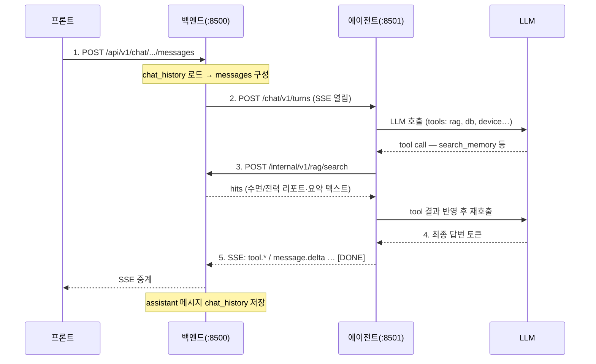

목차

- 서버 구성
- 백엔드 서버(:8500) -> 에이전트 서버(:8501)
    - LLM 모델 포워딩 API
    - 대화 (Chat) API
    - Sleep Analysis API
    - Power Analysis API
- 에이전트 서버(:8501) -> 백엔드 서버(:8500)
    - Tool API (후순위)
    - DB 조회 API
    - RAG 검색 API

---

## 서버 구성

- 프론트엔드 (React SPA) — API 미제공. 백엔드 `/api/v1` 만 호출하는 클라이언트.
- 백엔드 (C++ Drogon, :8500) — 유일한 공개 게이트웨이. 프론트 대상 API + 에이전트 대상 내부 API 제공. SQLite 소유·R/W 전담. RAG·DB 조회 수행.
- 에이전트 (Python FastAPI + LangGraph, :8501) — 내부 서버. 백엔드가 호출하는 에이전트 기능 제공. **DB에 직접 접근하지 않는다.**

예시:

- 프론트 -> 백엔드(:8500) : `/api/v1/*`
- 백엔드 -> 에이전트(:8501) : LLM 포워딩/수면·전력 분석/채팅 등 에이전트 기능 호출(데이터는 Body 로 전달). 인사이트 생성 API는 에이전트 담당 규격 확정 후 추가(후순위).
- 에이전트 -> 백엔드(:8500) : 장치제어/실시간상태/TTS/알림/예약/RAG 검색/DB 조회 등 내부 API 호출

---

## 백엔드 서버(:8500) -> 에이전트 서버(:8501)

---

### LLM 모델 포워딩 API

에이전트 서버가 제공하는 **LLM/임베딩 서비스 API**다. 실제 모델 제공자(Gemini API, Ollama 등)와의 연결은 에이전트 서버가 소유하고, 백엔드는 이 API를 호출해 LLM을 사용한다.

호출 방향: **백엔드(:8500) → 에이전트(:8501)**

### 공통

- Base URL: `/llm/v1` (에이전트 서버, `http://<agent>:8501/llm/v1`)
- OpenAI Chat Completions / Embeddings 호환 스키마를 따른다.
- 백엔드는 OpenAI SDK 등 표준 클라이언트의 `base_url`을 `http://<agent>:8501/llm/v1`로 두고  
사용할 수 있다.
- 공통 에러 응답: `{ "error": { "code": "...", "message": "..." } }`
- 채팅 히스토리는 이 API로 저장하지 않는다. 대화 기록은 백엔드가 `chat_history`에 관리한다.

**Response 400**

```json
{
  "error": {
    "code": "INVALID_REQUEST",
    "message": "요청 본문이 올바르지 않습니다.",
    "field": "messages"
  }
}
```

**Response 404**

```json
{
  "error": {
    "code": "MODEL_NOT_FOUND",
    "message": "지원하지 않는 model 입니다. /models 로 사용 가능한 모델을 조회하세요."
  }
}
```

**Response 502**

```json
{
  "error": {
    "code": "LLM_PROVIDER_ERROR",
    "message": "LLM 제공자 응답을 처리하지 못했습니다."
  }
}
```

**Response 504**

```json
{
  "error": {
    "code": "LLM_TIMEOUT",
    "message": "LLM 응답 생성 시간이 초과되었습니다."
  }
}
```


### 타입

```ts
type LlmModel = {
  id: string;           // 실제 모델 이름 (예: 'gemma4:12b-mlx')
  object: 'model';
  role: 'chat' | 'embedding';
  provider: string;     // 제공/호스팅 출처 라벨. 예: 'ollama' | 'openai' | 'gemini'. 추후 문자열 추가 가능
  dimension?: number;   // embedding 만
};

type ChatMessage = {
  role: 'system' | 'user' | 'assistant';
  content: string;
};

type ChatCompletionRequest = {
  model: string;   // 실제 모델 이름
  messages: ChatMessage[];
  temperature?: number;
  top_p?: number;
  max_tokens?: number;
  stop?: string | string[];
  seed?: number;
  frequency_penalty?: number;
  presence_penalty?: number;
  stream?: boolean;
};

type ChatCompletionChoice = {
  index: number;
  message: {
    role: 'assistant';
    content: string;
    reasoning?: string;   // thinking 모델일 때 추론 구간
  };
  finish_reason: 'stop' | 'length' | null;
};

type ChatCompletionResponse = {
  id: string;
  object: 'chat.completion';
  model: string;   // 실제 모델 이름
  choices: ChatCompletionChoice[];
  usage: {
    prompt_tokens: number;
    completion_tokens: number;
    total_tokens: number;
  };
};

type ChatCompletionChunk = {
  id: string;
  object: 'chat.completion.chunk';
  model: string;   // 실제 모델 이름
  choices: Array<{
    index: number;
    delta: {
      role?: 'assistant';
      content?: string;
      reasoning?: string;   // thinking 모델의 추론 구간
    };
    finish_reason: 'stop' | 'length' | null;
  }>;
};

type EmbeddingRequest = {
  model: string;   // 실제 임베딩 모델 이름
  input: string | string[];
};

type EmbeddingResponse = {
  object: 'list';
  model: string;   // 실제 임베딩 모델 이름
  data: Array<{
    index: number;
    embedding: number[];
  }>;
  usage: {
    prompt_tokens: number;
    total_tokens: number;
  };
};
```

---


### GET `/models`

에이전트 서버가 제공하는 실제 모델 목록을 반환한다. 백엔드 기동 시 또는 모델 선택 전에 조회한다.
`provider` 는 해당 모델이 **어느 백엔드/런타임에서 서빙되는지**를 나타내는 자유 텍스트 라벨이다
(고정 enum 아님). 예: `ollama`, `openai`, `gemini`.

**Response 200**

```json
{
  "object": "list",
  "data": [
    {
      "id": "gemma4:12b-mlx",
      "object": "model",
      "role": "chat",
      "provider": "ollama"
    },
    {
      "id": "gemma2:2b",
      "object": "model",
      "role": "chat",
      "provider": "ollama"
    },
    {
      "id": "nomic-embed-text",
      "object": "model",
      "role": "embedding",
      "provider": "ollama",
      "dimension": 768
    }
  ]
}
```

---


### POST `/chat/completions`

채팅/생성 요청. `stream=false`이면 단일 JSON, `stream=true`이면 **SSE**로 토큰을 스트리밍한다.

**Request Body** — 비스트리밍

```json
{
  "model": "gemma4:12b-mlx",
  "messages": [
    { "role": "system", "content": "You are a smart home health assistant." },
    { "role": "user", "content": "어젯밤 수면을 3문장으로 요약해줘." }
  ],
  "temperature": 0.7,
  "max_tokens": 512,
  "stream": false
}
```

**Response 200**

```json
{
  "id": "chatcmpl_01J2ZQ8M6R9P4T7X3A5B2C1D0E",
  "object": "chat.completion",
  "model": "gemma4:12b-mlx",
  "choices": [
    {
      "index": 0,
      "message": {
        "role": "assistant",
        "content": "어젯밤 총 수면은 6시간 20분이었고, 입면까지 35분이 걸렸습니다. 새벽 3시경 뒤척임이 늘었습니다.",
        "reasoning": null
      },
      "finish_reason": "stop"
    }
  ],
  "usage": {
    "prompt_tokens": 42,
    "completion_tokens": 68,
    "total_tokens": 110
  }
}
```

**Request Body** — 스트리밍

```json
{
  "model": "gemma2:2b",
  "messages": [
    { "role": "user", "content": "오늘 전력 사용 패턴을 한 줄로 말해줘." }
  ],
  "stream": true
}
```

**Response 200 (SSE)**

헤더:

```http
Content-Type: text/event-stream
Cache-Control: no-cache
Connection: keep-alive
```

본문 예시:

```text
data: {"id":"chatcmpl_01J2ZQ91BN4R8E5Y6W3T0P7M2C","object":"chat.completion.chunk","model":"gemma2:2b","choices":[{"index":0,"delta":{"role":"assistant"},"finish_reason":null}]}

data: {"id":"chatcmpl_01J2ZQ91BN4R8E5Y6W3T0P7M2C","object":"chat.completion.chunk","model":"gemma2:2b","choices":[{"index":0,"delta":{"reasoning":"사용자가 전력 패턴을 물었다."},"finish_reason":null}]}

data: {"id":"chatcmpl_01J2ZQ91BN4R8E5Y6W3T0P7M2C","object":"chat.completion.chunk","model":"gemma2:2b","choices":[{"index":0,"delta":{"content":"저녁"},"finish_reason":null}]}

data: {"id":"chatcmpl_01J2ZQ91BN4R8E5Y6W3T0P7M2C","object":"chat.completion.chunk","model":"gemma2:2b","choices":[{"index":0,"delta":{"content":" 시간대에"},"finish_reason":null}]}

data: {"id":"chatcmpl_01J2ZQ91BN4R8E5Y6W3T0P7M2C","object":"chat.completion.chunk","model":"gemma2:2b","choices":[{"index":0,"delta":{},"finish_reason":"stop"}]}

data: [DONE]
```

스트리밍 규칙:

- 각 이벤트는 `data: <json>\n\n` 형식이다.
- `choices[0].delta.content`를 누적하면 최종 답변 텍스트가 된다.
- thinking 모델은 `choices[0].delta.reasoning`으로 추론 구간을 별도 전송한다.
- 종료는 반드시 `data: [DONE]\n\n`으로 마무리한다.
- 스트림 시작 **전** 오류는 일반 HTTP 4xx/5xx + JSON 에러 본문으로 반환한다.
- 스트림 시작 **후** 오류는 `data: {"error":{"code":"LLM_PROVIDER_ERROR","message":"..."}}\n\n`을
보낸 뒤 연결을 닫는다.
- 백엔드(클라이언트)가 연결을 끊으면 에이전트는 상위 LLM 생성 요청을 즉시 취소한다.

**Response 400**

```json
{
  "error": {
    "code": "INVALID_REQUEST",
    "message": "messages 는 최소 1개 이상이어야 합니다.",
    "field": "messages"
  }
}
```

---


### POST `/embeddings`

텍스트 임베딩을 생성한다. RAG 인덱싱·검색에 사용한다. 스트리밍은 지원하지 않는다.

**Request Body** — 단일 입력

```json
{
  "model": "nomic-embed-text",
  "input": "어젯밤 수면 효율이 78%였고 새벽에 뒤척임이 늘었다."
}
```

**Request Body** — 배치 입력

```json
{
  "model": "nomic-embed-text",
  "input": [
    "어젯밤 수면 효율이 78%였다.",
    "거실 에어컨 사용량이 평소보다 30% 높았다."
  ]
}
```

**Response 200**

```json
{
  "object": "list",
  "model": "nomic-embed-text",
  "data": [
    {
      "index": 0,
      "embedding": [0.0123, -0.0456, 0.0789]
    }
  ],
  "usage": {
    "prompt_tokens": 18,
    "total_tokens": 18
  }
}
```

`embedding` 배열 길이는 에이전트 서버의 임베딩 모델 차원(예: 768)과 같다.

**Response 400**

```json
{
  "error": {
    "code": "INVALID_REQUEST",
    "message": "input 은 비어 있을 수 없습니다.",
    "field": "input"
  }
}
```

---


### 전체 엔드포인트 요약

```http
GET  /llm/v1/models
POST /llm/v1/chat/completions
POST /llm/v1/embeddings
```


### 백엔드 연동 지점

- 백엔드가 LLM이 필요한 작업(데일리 메시지·리포트 생성 등)에서 `/models`로 조회한 실제 모델 이름을
지정해 `/chat/completions`를 호출한다.
- 프론트로 실시간 응답을 흘려야 하면 `stream: true`로 SSE를 소비해 그대로 중계한다.
- RAG용 임베딩이 필요하면 `/embeddings`로 텍스트를 벡터화한다.
- 백엔드는 이 API를 통해서만 LLM에 접근한다. 제공자(Gemini/Ollama) URL을 직접 호출하지 않는다.
- **챗 턴**(`/chat/v1/turns`) LLM 은 에이전트가 직접 호출하므로 이 포워딩 API 와 무관하다.

---


### 대화 (Chat) API

에이전트 서버가 제공하는 **에이전틱 대화 API**다. 백엔드가 한 번의 대화 턴을 요청하면, 에이전트가
LangGraph 로 돌며 **필요할 때** 백엔드에 RAG·DB 조회·기기 제어 등을 tool 로 요청하고, 최종 답변을 **SSE** 로
스트리밍한다.

**기본 흐름**(권장):

1. 프론트 → 백엔드: 채팅 메시지 수신
2. 백엔드 → 에이전트: `POST /chat/v1/turns` (`messages` + `userId` 등. **RAG 결과는 아직 없음**)
3. 에이전트(LangGraph): LLM 이 필요하다고 판단 → `POST /internal/v1/rag/search` 등 **tool 호출**
4. 백엔드: RAG 수행 후 결과 반환
5. 에이전트: 수신 스니펫 + 대화로 답변 생성 → SSE 스트림
6. 백엔드: SSE 수신 → 프론트 표시 + `chat_history` 저장

호출 방향: **백엔드(:8500) → 에이전트(:8501)** (단, 3단계 tool 은 에이전트 → 백엔드)

한 턴에서 커넥션은 2종류가 동시에 열린다.

- **백엔드 → 에이전트 (긴 SSE 1개)**: 턴 실행 요청이자 토큰을 되돌려받는 채널.
- **에이전트 → 백엔드 (짧은 동기 HTTP 여러 개)**: LangGraph 가 tool 을 부를 때마다 나가는 별개 요청.
- 두 커넥션은 독립적이라 데드락이 없다. 백엔드는 SSE 를 흘리는 중에도 다른 스레드로 tool 요청을 처리한다.




### 공통

- Base URL: `/chat/v1` (에이전트 서버, `http://<agent>:8501/chat/v1`)
- 대화는 실시간이라 리포트/요약과 달리 **SSE** 를 쓴다(잡 패턴 아님).
- **LLM 호출은 에이전트가 직접** 수행한다(Ollama 로컬 모델, OpenAI 호환 외부 API 등). `/llm/v1` 포워딩 API 를
  거치지 않는다. 백엔드가 쓰는 LLM 포워딩과 챗 턴 LLM 은 별개 경로다.
- 대화 기록(`chat_history`)은 백엔드가 소유·저장한다. `chatHistoryId` 는 `chat_history.id`(INTEGER)와 1:1이다.
  에이전트는 요청으로 받은 `messages` 로만 판단하고 DB 에 쓰지 않는다.
- `model`(옵션): 요청은 선호일 뿐 에이전트가 유연하게 선택하고, 실제 사용 모델을
  `message.completed` 이벤트의 `model` 로 돌려준다.
- `context.now`(옵션): 현재 시각. 백엔드가 넣어 주면 “어제”·“오늘 밤” 해석에 사용.
- `context.retrieved`(옵션, **사전검색**): RAG 를 **턴 시작 전** 백엔드가 미리 호출해 넣는 스니펫.
  **기본 흐름(위 1~6)에서는 사용하지 않는다.** 에이전트가 턴 중 `/rag/search` tool 로 가져오는 것이
  정식 경로다. 사전검색은 latency 줄이기·항상 같은 컨텍스트 주입 같은 **최적화**용.
  넣을 경우 RAG `hits` 를 `{ collection, refId?, text }[]` 로 평탄화한다.
  RAG 대상(`vec_*`)은 3종뿐:
  - `sleep_report` — 일/주간 수면 리포트 본문
  - `sleep_stat` — 30m 수면 요약(`summary_text`)
  - `power_report` — 전력 리포트 본문
  raw 통계·인사이트 등은 벡터 없음 → RAG/`retrieved` 불가(DB 조회 tool 사용).
- 공통 에러 응답: `{ "error": { "code": "...", "message": "..." } }`


### 타입

```ts
type ChatTurnRequest = {
  chatHistoryId: number;    // chat_history.id
  userId: number;
  messages: { role: 'system' | 'user' | 'assistant'; content: string }[];
  context?: {
    now?: string;   // 'YYYY-MM-DD HH:MM:SS'
    retrieved?: { collection: string; refId?: number; text: string }[];
  };
  model?: string;
  stream?: boolean;   // 기본 true
};

// SSE 이벤트 (data: <json>\n\n)
type ChatStreamEvent =
  | { type: 'tool.start'; name: string; args: object }
  | { type: 'tool.end'; name: string; ok: boolean; result?: object }
  | { type: 'message.delta'; content?: string; reasoning?: string }
  | { type: 'message.completed'; content: string; model: string };
```


### POST `/turns`

대화 턴을 실행한다. `stream=true`(기본)면 **SSE**, `false`면 단일 JSON(`message.completed` 페이로드)을 반환한다.

**Request Body**

```json
{
  "chatHistoryId": 42,
  "userId": 1,
  "messages": [
    { "role": "user", "content": "거실 너무 더운데 에어컨 켜줘" }
  ],
  "context": { "now": "2026-07-04 03:10:00" },
  "stream": true
}
```

**Response 200 (SSE)**

헤더:

```http
Content-Type: text/event-stream
Cache-Control: no-cache
Connection: keep-alive
```

본문 예시:

```text
data: {"type":"tool.start","name":"control_device","args":{"room":"거실","appliance":"aircon","action":"on"}}

data: {"type":"tool.end","name":"control_device","ok":true,"result":{"temperature":26}}

data: {"type":"message.delta","content":"거실 "}

data: {"type":"message.delta","content":"에어컨을 켰어요."}

data: {"type":"message.completed","content":"거실 에어컨을 켰어요. 현재 28℃라 26℃로 맞췄어요.","model":"gemma4:12b-mlx"}

data: [DONE]
```

스트리밍 규칙:

- 각 이벤트는 `data: <json>\n\n` 형식이다.
- `message.delta.content` 를 누적하면 최종 답변이 된다. `tool.start`/`tool.end` 는 진행 표시용이다.
- thinking 모델은 `message.delta.reasoning` 으로 추론 구간을 별도 전송한다.
- 종료는 반드시 `data: [DONE]\n\n` 으로 마무리한다.
- 스트림 시작 후 오류는 `data: {"type":"error","error":{...}}\n\n` 을 보낸 뒤 연결을 닫는다.
- 백엔드가 연결을 끊으면 에이전트는 진행 중인 그래프 실행을 취소한다.

**Response 400**

```json
{
  "error": {
    "code": "INVALID_REQUEST",
    "message": "messages 는 최소 1개 이상이어야 합니다.",
    "field": "messages"
  }
}
```


### 전체 엔드포인트 요약

```http
POST /chat/v1/turns
```


### 백엔드 연동 지점

- 프론트 메시지 수신 → `chat_history` 로드 → **`messages`만** 구성해 `/chat/v1/turns` 호출(RAG 는 에이전트 tool).
- `context.now` 정도만 넣고, `context.retrieved` 는 기본적으로 **비운다**.
- SSE 를 프론트로 그대로 중계하거나(스트리밍 UX), 완성본만 모아 단일 응답으로 돌려준다.
- 완성된 assistant 메시지는 백엔드가 `chat_history.message` json 에 append 후 저장한다.
- 턴 도중 `tool.*` 는 실제로는 에이전트가 백엔드 tool API 를 호출한 결과다(아래 에이전트→백엔드 참고).

---


### Sleep Analysis API

에이전트 서버가 제공하는 **수면 분석·리포트 생성 API**다. 백엔드가 DB 에서 조회한 데이터를 Body 로
넘기면, 에이전트는 자연어 요약·리포트 본문(및 임베딩)을 생성해 반환한다. 추가 데이터가 필요하면
에이전트가 백엔드 DB 조회 API(`/internal/v1/db/query`)를 호출한다. 저장(`sleep_stat.summary_text`, `sleep_report`,
`vec_*`)은 백엔드가 응답을 받은 뒤 수행한다.

호출 방향: **백엔드(:8500) → 에이전트(:8501)**

### 공통

- Base URL: `/sleep/v1` (에이전트 서버, `http://<agent>:8501/sleep/v1`)
- 백엔드가 요청 시에만 에이전트를 호출한다. 에이전트는 자체 스케줄로 분석하지 않는다.
- **SQLite 접근은 백엔드 전담**이다. 에이전트는 `dbUrl`·row id 로 DB 를 열지 않는다.
- 백엔드는 생성 요청 시 **인라인 데이터 + metrics**(리포트)를 Body 에 함께 실어 보낸다. 에이전트는
필요 없는 필드는 무시하고, 부족하면 DB 조회 API 로 보강한다.
- 요약(`/summaries`): 대상 **30m** `sleep_stat` **윈도우 1개**(`window`)를 인라인으로 전달한다.
- 리포트(`/reports`): 해당 기간의 `metrics`**(백엔드 계산) +** `sessions` **+** `stats30m` 를 인라인으로 전달한다.
daily 도 하루에 여러 세션이 있으면 `sessions` 배열에 모두 담는다.
- 리포트 종류는 경로가 아니라 Body 의 `period` 로 구분한다.
- `embed`(기본 `true`): 응답에 임베딩 벡터를 함께 생성해 담는다. 백엔드는 이를 그대로 `vec_*` 에
넣으면 되고, 별도 임베딩 호출이 필요 없다. `false` 면 텍스트만 반환한다.
  - 임베딩 모델/차원은 스키마의 `vec_*`(nomic-embed-text, 768)과 일치한다.
- `model`(옵션): 생성에 쓸 모델 이름. `embeddingModel`(옵션): 임베딩에 쓸 모델 이름. 둘 다 생략 가능.
  - 에이전트는 요청된 모델을 우선 고려하되, 상황(부하/컨텍스트 길이 등)에 따라 유연하게 다른 모델을
  선택할 수 있다. 실제 사용한 모델 이름은 응답의 `model`·`embeddingModel` 로 돌려준다.
  - `embeddingModel` 을 바꿔 임베딩 차원이 달라지면 `vec_*` 스키마와 어긋날 수 있으니 백엔드가 확인한다.
- **지표(metrics) 계산은 백엔드가 수행**한다. 에이전트는 metrics 와 인라인 통계를 바탕으로 **자연어
텍스트와 임베딩만** 반환한다(`sleep_report.metrics` 저장은 백엔드 몫).
- 요약/리포트 생성은 실시간이 아니므로 **비동기 잡(job)** 으로 처리한다. `POST` 는 즉시 `202` + `jobId`
를 반환하고, `GET /sleep/v1/jobs/{jobId}` 로 폴링해 완료 시 결과를 받는다(SSE 미사용).
- **잡 운영 규칙**(전력 API 동일):
  - **중복 요청**: 동일 대상(요약=`window.id`, 리포트=`userId`+`period`+`periodStart`)에 `queued`/`running`
    job 이 있으면 `POST` 는 **409** `JOB_ALREADY_RUNNING`.
  - **jobId 보존**: `done`/`failed` 후 **24시간** 동안 `GET /jobs/{jobId}` 조회 가능. 이후 `404`.
  - **폴링**: 1~3초 간격 시작, 30초 경과 후 5~10초 백오프.
  - **재시도**: `failed` job 은 재개하지 않는다. 새 `POST` 로 잡을 다시 만든다.
  - **POST vs job 실패**: 입력 검증(빈 `sessions`, 잘못된 `window` 등)은 **POST 400**. LLM 생성 실패·타임아웃은
    job `failed`(`GENERATION_FAILED`, `GENERATION_TIMEOUT`).
- 날짜·시각 포맷은 DB 스키마와 동일: `YYYY-MM-DD`, `YYYY-MM-DD HH:MM:SS`.
- 공통 에러 응답: `{ "error": { "code": "...", "message": "..." } }`

**Response 400**

```json
{
  "error": {
    "code": "INVALID_REQUEST",
    "message": "period는 daily 또는 weekly 여야 합니다.",
    "field": "period"
  }
}
```

**Response 400** — 윈도우 검증 실패

```json
{
  "error": {
    "code": "INVALID_WINDOW",
    "message": "window.granularity 는 30m 이어야 합니다.",
    "field": "window.granularity"
  }
}
```

**Response 400** — 리포트 데이터 부족

```json
{
  "error": {
    "code": "NO_SLEEP_DATA",
    "message": "sessions 가 비어 있습니다. 해당 기간 수면 데이터를 먼저 조회해 Body 를 구성하세요.",
    "field": "sessions"
  }
}
```

**Response 409** — 동일 대상 잡 진행 중

```json
{
  "error": {
    "code": "JOB_ALREADY_RUNNING",
    "message": "동일 대상에 대한 job 이 이미 queued/running 상태입니다.",
    "jobId": "job_01J2ZS7N2Q6R9T4X1A2B3C4D5E"
  }
}
```

**Response 502** — 잡 큐 등록 실패

```json
{
  "error": {
    "code": "GENERATION_FAILED",
    "message": "job 을 큐에 등록하지 못했습니다."
  }
}
```


### 타입

```ts
// db-schema.md sleep_stat / sleep_session 컬럼 (camelCase)
type SleepStatRow = {
  id: number; userId: number; roomId: number; sessionId: number | null;
  granularity: '1m' | '30m'; timeStart: string; timeEnd: string | null;
  coverage: number; stageLabel: string | null; stageRatio: object | null;
  stageConfidence: number | null; statusRatio: object | null;
  tossMean: number | null; tossMax: number | null; tossP90: number | null;
  tossEvents: number | null; tossRatio: object | null;
  hrMean: number | null; hrMin: number | null; hrMax: number | null; hrStd: number | null;
  brMean: number | null; brMin: number | null; brMax: number | null; brStd: number | null;
  snoreRatio: number | null; envTemp: number | null; envLux: number | null; envNoise: number | null;
};

type SleepSessionRow = {
  id: number; userId: number; roomId: number; radarId: number; stationId: number | null;
  nightDate: string; onset: string | null; finalWake: string | null;
  timeInBedS: number | null; asleepTotalS: number | null; efficiency: number | null;
  stageTotals: object | null; tossEvents: number | null;
  hrMean: number | null; brMean: number | null; snoreRatio: number | null;
};

type SummaryRequest = {
  window: SleepStatRow;       // granularity='30m' 대상 윈도우
  minutes?: SleepStatRow[];   // 옵션: 같은 구간 1m 행들
  embed?: boolean;            // 기본 true
  model?: string;
  embeddingModel?: string;
};

type SummaryResponse = {
  statId: number;             // window.id
  summaryText: string;        // sleep_stat.summary_text 에 저장
  embedding: number[] | null;
  model: string;
  embeddingModel: string | null;
};

type ReportRequest = {
  userId: number;
  period: 'daily' | 'weekly';
  periodStart: string;        // daily: date, weekly: weekStart
  metrics: object;              // 백엔드가 계산한 구조화 지표
  sessions: SleepSessionRow[];  // 해당 기간 세션( daily 도 여러 개 가능)
  stats30m: SleepStatRow[];     // 해당 기간 30m 통계
  embed?: boolean;
  model?: string;
  embeddingModel?: string;
};

type ReportResponse = {
  period: 'daily' | 'weekly';
  periodStart: string;
  reportText: string;
  embedding: number[] | null;
  model: string;
  embeddingModel: string | null;
};

// 잡(job) 공통
type JobRef = {
  jobId: string;
  status: 'queued';
};

type JobStatus<T> = {
  jobId: string;
  status: 'queued' | 'running' | 'done' | 'failed';
  result?: T;
  error?: { code: string; message: string };
};
```

---


### POST `/summaries`

30분(`sleep_stat.granularity='30m'`) 구간의 자연어 요약을 생성한다. RAG·에이전트 입력용
`summary_text`(및 `vec_sleep_stat` 임베딩)를 만들 때 사용한다.

백엔드는 대상 30m 윈도우를 `window` 로 인라인 전달한다. 더 정밀한 서술이 필요하면 `minutes`(1m 행)를
함께 실을 수 있다.

**Request Body**

```json
{
  "window": {
    "id": 4123, "userId": 1, "roomId": 1, "sessionId": 88,
    "granularity": "30m", "timeStart": "2026-07-01 02:00:00", "timeEnd": "2026-07-01 02:30:00",
    "coverage": 0.98, "stageLabel": "deep",
    "stageRatio": { "deep": 0.62, "light": 0.30, "rem": 0.08 },
    "statusRatio": { "asleep": 0.95, "awake": 0.05, "absent": 0.0 },
    "tossMean": 0.12, "tossEvents": 2, "hrMean": 58.1, "brMean": 14.2,
    "snoreRatio": 0.03, "envTemp": 24.2, "envLux": 0.0, "envNoise": 32.1
  },
  "embed": true,
  "model": "gemma4:12b-mlx",
  "embeddingModel": "nomic-embed-text"
}
```

**Response 202** — 잡 생성됨

```json
{ "jobId": "job_01J2ZS5K8M4P7R2X9A0B1C2D3E", "status": "queued" }
```

완료 시 `GET /sleep/v1/jobs/{jobId}` 의 `result` (SummaryResponse):

```json
{
  "statId": 4123,
  "summaryText": "02:00~02:30 구간은 깊은 수면이 지배적이었고 심박은 58bpm 전후로 안정적이었습니다. 코골이는 거의 감지되지 않았고 실내 온도는 24.2℃를 유지했습니다.",
  "embedding": [0.0123, -0.0456, 0.0789],
  "model": "gemma4:12b-mlx",
  "embeddingModel": "nomic-embed-text"
}
```

---


### POST `/reports`

일일/주간 리포트를 생성한다. `period`·`periodStart` 로 종류와 기간을 지정하고, 백엔드가 계산한
`metrics` 와 해당 기간의 `sessions`·`stats30m` 을 인라인으로 전달한다.
`sleep_report`(및 `vec_sleep_report`)에 저장할 `reportText`·`embedding` 을 반환한다.

- `period="daily"` — `periodStart`=night_date. 그날 `sleep_session`·30m 통계를 `sessions`/`stats30m` 에 담는다.
- `period="weekly"` — `periodStart`=weekStart(월요일). 그 주 7일치를 `sessions`/`stats30m` 에 담는다.
- 추가 세부가 필요하면 에이전트가 DB 조회 API 로 보강한다.

**Request Body** — daily

```json
{
  "userId": 1,
  "period": "daily",
  "periodStart": "2026-07-01",
  "metrics": {
    "asleepTotalS": 20160, "timeInBedS": 26880, "efficiency": 0.75,
    "latencyS": 2100, "tossEvents": 18, "snoreRatio": 0.12
  },
  "sessions": [
    {
      "id": 88, "userId": 1, "roomId": 1, "radarId": 7714208883279181, "stationId": null,
      "nightDate": "2026-07-01", "onset": "2026-07-01 00:35:00", "finalWake": "2026-07-01 07:55:00",
      "timeInBedS": 26880, "asleepTotalS": 20160, "efficiency": 0.75,
      "tossEvents": 18, "hrMean": 59.2, "brMean": 14.5, "snoreRatio": 0.12
    }
  ],
  "stats30m": [
    {
      "id": 4120, "userId": 1, "roomId": 1, "sessionId": 88,
      "granularity": "30m", "timeStart": "2026-07-01 03:00:00", "timeEnd": "2026-07-01 03:30:00",
      "coverage": 0.97, "stageLabel": "light", "tossMean": 0.28, "tossEvents": 6,
      "hrMean": 62.0, "snoreRatio": 0.18, "envTemp": 24.5
    }
  ],
  "embed": true
}
```

**Response 202** — 잡 생성됨

```json
{ "jobId": "job_01J2ZS7N2Q6R9T4X1A2B3C4D5E", "status": "queued" }
```

완료 시 `GET /sleep/v1/jobs/{jobId}` 의 `result` (ReportResponse, daily):

```json
{
  "period": "daily",
  "periodStart": "2026-07-01",
  "reportText": "7월 1일 밤 수면은 총 5시간 36분으로 목표보다 30분 부족했습니다. 입면까지 35분이 걸렸고 새벽 3시 이후 뒤척임이 늘었습니다. 코골이 비율은 전일보다 소폭 증가했으나 수면 효율은 75%로 양호한 편입니다.",
  "embedding": [0.0123, -0.0456, 0.0789],
  "model": "gemma4:12b-mlx",
  "embeddingModel": "nomic-embed-text"
}
```

**Request Body** — weekly

> 아래 `sessions`/`stats30m` 빈 배열은 축약 예시다. 실제 호출 시 백엔드가 DB 에서 해당 주 7일치
> 세션·30m 통계를 조회해 채운다.

```json
{
  "userId": 1,
  "period": "weekly",
  "periodStart": "2026-06-29",
  "metrics": {
    "avgAsleepS": 20400, "avgEfficiency": 0.73, "bedtimeDriftMin": 30
  },
  "sessions": [],
  "stats30m": [],
  "embed": true
}
```

**Response 202** — 잡 생성됨

```json
{ "jobId": "job_01J2ZS9P4S8T2V6X3A4B5C6D7E", "status": "queued" }
```

완료 시 `GET /sleep/v1/jobs/{jobId}` 의 `result` (ReportResponse, weekly):

```json
{
  "period": "weekly",
  "periodStart": "2026-06-29",
  "reportText": "6월 29일~7월 5일 주간 평균 수면은 5시간 40분 수준이었습니다. 주 초반보다 후반으로 갈수록 입면 시간이 짧아지고 깊은 수면 비율이 개선되었습니다. 주말 취침 시각이 30분 늦어진 패턴이 보입니다.",
  "embedding": [0.0123, -0.0456, 0.0789],
  "model": "gemma4:12b-mlx",
  "embeddingModel": "nomic-embed-text"
}
```

**Response 400**

```json
{
  "error": {
    "code": "INVALID_WEEK_START",
    "message": "weekStart는 해당 주의 월요일 날짜여야 합니다.",
    "field": "periodStart"
  }
}
```

---


### GET `/jobs/{jobId}`

`/summaries`·`/reports` 로 생성한 잡의 상태와 결과를 조회한다. 완료(`done`)면 `result` 에
해당 응답 타입(`SummaryResponse` 또는 `ReportResponse`)이 담긴다.

**Response 200** — 진행 중

```json
{ "jobId": "job_01J2ZS7N2Q6R9T4X1A2B3C4D5E", "status": "running" }
```

**Response 200** — 완료

```json
{
  "jobId": "job_01J2ZS7N2Q6R9T4X1A2B3C4D5E",
  "status": "done",
  "result": {
    "period": "daily",
    "periodStart": "2026-07-01",
    "reportText": "7월 1일 밤 수면은 총 5시간 36분으로 목표보다 30분 부족했습니다. ...",
    "embedding": [0.0123, -0.0456, 0.0789],
    "model": "gemma4:12b-mlx",
    "embeddingModel": "nomic-embed-text"
  }
}
```

**Response 200** — 실패 (생성 타임아웃)

```json
{
  "jobId": "job_01J2ZS7N2Q6R9T4X1A2B3C4D5E",
  "status": "failed",
  "error": { "code": "GENERATION_TIMEOUT", "message": "수면 분석 생성 시간이 초과되었습니다." }
}
```

**Response 200** — 실패 (생성 오류)

```json
{
  "jobId": "job_01J2ZS7N2Q6R9T4X1A2B3C4D5E",
  "status": "failed",
  "error": { "code": "GENERATION_FAILED", "message": "수면 리포트를 생성하지 못했습니다." }
}
```

**Response 404**

```json
{
  "error": {
    "code": "JOB_NOT_FOUND",
    "message": "jobId 에 해당하는 작업이 없습니다."
  }
}
```

---


### 전체 엔드포인트 요약

```http
POST /sleep/v1/summaries
POST /sleep/v1/reports
GET  /sleep/v1/jobs/{jobId}
```


### 백엔드 연동 지점

- 30m `sleep_stat` 행이 생긴 뒤(또는 백필 시) 해당 윈도우를 `window` 로 `/summaries` 에 실어 호출해
`jobId` 를 받고, `/jobs/{jobId}` 폴링으로 완료되면 `result.summaryText` 를 `sleep_stat.summary_text` 에,
`result.embedding` 을 `vec_sleep_stat` 에 저장한다.
- 프론트의 `GET /api/v1/sleep/reports/daily`·`weekly` 요청 전, 캐시가 없으면 DB 에서 `metrics`·`sessions`·
`stats30m` 을 조회해 `/reports` Body 를 구성하고 잡을 만든다. 완료 후 `result.reportText` 와 함께
`sleep_report` 에 upsert, `result.embedding` 을 `vec_sleep_report` 에 저장한다.
- 리포트는 즉시 필요하지 않으므로, 프론트에는 "생성 중" 을 먼저 응답하고 완료되면 캐시로 제공해도 된다.
- `embed=true` 로 임베딩을 함께 받으므로 별도 `/llm/v1/embeddings` 호출은 필요 없다(원하면 `false`).
- 인사이트(`insight`) 생성 API — **에이전트 담당 규격 작성 후** 백엔드 연동(후순위). 일일/주간 리포트와 구분.

---


### Power Analysis API

에이전트 서버가 제공하는 **전력 리포트 생성 API**다. 백엔드가 DB 에서 조회한 `metrics`·대상
`power_energy` 행(및 하위 구간)을 Body 로 넘기면, 에이전트는 자연어 요약(및 임베딩)을 생성해 반환한다.
추가 데이터가 필요하면 에이전트가 백엔드 DB 조회 API(`/internal/v1/db/query`)를 호출한다.
저장(`power_report.report_text`, `vec_power_report`)은 백엔드가 응답을 받은 뒤 수행한다.

호출 방향: **백엔드(:8500) → 에이전트(:8501)**

### 공통

- Base URL: `/power/v1` (에이전트 서버, `http://<agent>:8501/power/v1`)
- **SQLite 접근은 백엔드 전담**이다. 에이전트는 `dbUrl`·`energyId` 로 DB 를 열지 않는다.
- 백엔드는 생성 요청 시 `metrics`**(백엔드 계산) +** `target`**(대상 power_energy 행) +** `children`**(하위 구간,
옵션)** 을 Body 에 함께 실어 보낸다. 에이전트는 필요 없는 필드는 무시하고, 부족하면 DB 조회 API 로 보강한다.
- `embed`(기본 `true`)로 임베딩 동봉. **지표(metrics)는 백엔드가 계산**하고 에이전트는 텍스트/임베딩만 반환.
- 생성도 수면과 동일하게 **비동기 잡(job)** 이다. `POST /reports` 는 `202` + `jobId` 를 반환하고,
`GET /power/v1/jobs/{jobId}` 로 폴링해 결과를 받는다(SSE 미사용).
- **잡 운영 규칙**은 수면 API 와 동일하다. 중복 대상=`target.id`(동일 `energyId`).
- `model`·`embeddingModel`(옵션)도 수면 API 와 동일하다.
- `period` 종류: `1h` | `24h` | `1w` | `1mo`. `5m` 은 리포트 대상이 아니다.
- `deviceId = null` 이면 **계측 플러그 합산** 리포트, 특정 장치면 그 장치 리포트다.
- `1w`/`1mo` 리포트는 창 내 하위 `24h` 행을 `children` 에 담아 전달한다.
- 공통 에러 응답: `{ "error": { "code": "...", "message": "..." } }`

**Response 400**

```json
{
  "error": {
    "code": "INVALID_REQUEST",
    "message": "target.granularity 는 리포트 대상(1h/24h/1w/1mo)이어야 합니다.",
    "field": "target.granularity"
  }
}
```

**Response 409** — 동일 대상 잡 진행 중

```json
{
  "error": {
    "code": "JOB_ALREADY_RUNNING",
    "message": "동일 energyId(target.id)에 대한 job 이 이미 queued/running 상태입니다.",
    "jobId": "job_01J2ZSB6W9X3Y7Z2A3B4C5D6E7"
  }
}
```


### 타입

```ts
// db-schema.md power_energy 컬럼 (camelCase)
type PowerEnergyRow = {
  id: number; deviceId: number | null;   // null = 계측 플러그 합산
  granularity: '5m' | '1h' | '24h' | '1w' | '1mo';
  timeStart: string; energyWh: number; coverage: number; sampleCount: number;
};

type PowerReportRequest = {
  deviceId: number | null;
  period: '1h' | '24h' | '1w' | '1mo';
  periodStart: string;
  metrics: object;              // 백엔드가 계산한 구조화 지표
  target: PowerEnergyRow;       // 대상 power_energy 행(granularity = period)
  children?: PowerEnergyRow[]; // 하위 구간(24h→1h, 1w/1mo→24h). 옵션
  embed?: boolean;
  model?: string;
  embeddingModel?: string;
};

type PowerReportResponse = {
  energyId: number;             // target.id
  period: '1h' | '24h' | '1w' | '1mo';
  periodStart: string;
  deviceId: number | null;
  reportText: string;
  embedding: number[] | null;
  model: string;
  embeddingModel: string | null;
};

// 잡(job) 공통 (수면 API 와 동일)
type JobRef = { jobId: string; status: 'queued'; };
type JobStatus<T> = {
  jobId: string;
  status: 'queued' | 'running' | 'done' | 'failed';
  result?: T;
  error?: { code: string; message: string };
};
```

---


### POST `/reports`

전력 리포트를 생성한다. 백엔드가 계산한 `metrics` 와 대상 `target` 행(및 `children`)을 바탕으로
자연어 요약을 만든다.

**Request Body** — 24h 합산(`deviceId = null`)

```json
{
  "deviceId": null,
  "period": "24h",
  "periodStart": "2026-07-01",
  "metrics": {
    "energyWh": 3820.5, "energyKwh": 3.82, "peakW": 1180.4,
    "peakAt": "2026-07-01 22:05:00", "vsPrevPct": 12.3,
    "byDevice": [
      { "deviceId": 7714208883279181, "name": "거실 에어컨", "energyWh": 3120.0, "share": 0.82 }
    ]
  },
  "target": {
    "id": 20514, "deviceId": null, "granularity": "24h",
    "timeStart": "2026-07-01", "energyWh": 3820.5, "coverage": 0.98, "sampleCount": 288
  },
  "children": [
    {
      "id": 20401, "deviceId": null, "granularity": "1h",
      "timeStart": "2026-07-01 22:00:00", "energyWh": 1180.4, "coverage": 0.98, "sampleCount": 12
    }
  ],
  "embed": true,
  "model": "gemma4:12b-mlx",
  "embeddingModel": "nomic-embed-text"
}
```

**Response 202** — 잡 생성됨

```json
{ "jobId": "job_01J2ZSB6W9X3Y7Z2A3B4C5D6E7", "status": "queued" }
```

완료 시 `GET /power/v1/jobs/{jobId}` 의 `result` (PowerReportResponse, 24h 합산):

```json
{
  "energyId": 20514,
  "period": "24h",
  "periodStart": "2026-07-01",
  "deviceId": null,
  "reportText": "7월 1일 하루 전력 사용량은 3.82kWh 로 전일보다 12% 늘었습니다. 저녁 10시경 1.18kW 로 피크를 찍었고, 사용량의 82%가 거실 에어컨이었습니다. 낮 시간대에는 대기전력 위주로 거의 사용이 없었습니다.",
  "embedding": [0.0123, -0.0456, 0.0789],
  "model": "gemma4:12b-mlx",
  "embeddingModel": "nomic-embed-text"
}
```

완료 시 `result` (1mo 합산):

```json
{
  "energyId": 20988,
  "period": "1mo",
  "periodStart": "2026-06-03",
  "deviceId": null,
  "reportText": "최근 30일 총 전력 사용량은 약 115kWh, 일평균 3.8kWh 였습니다. 사용의 대부분(약 78%)이 에어컨이었고, 월 초 대기전력 위주에서 7월로 갈수록 냉방 사용이 크게 늘어난 추세가 뚜렷합니다.",
  "embedding": [0.0123, -0.0456, 0.0789],
  "model": "gemma4:12b-mlx",
  "embeddingModel": "nomic-embed-text"
}
```

---


### GET `/jobs/{jobId}`

`/reports` 로 생성한 잡의 상태와 결과를 조회한다. 완료(`done`)면 `result` 에 `PowerReportResponse`
가 담긴다. 수면 API 의 `/jobs` 와 동일한 규약·운영 규칙을 따른다.

**Response 200** — 완료

```json
{
  "jobId": "job_01J2ZSB6W9X3Y7Z2A3B4C5D6E7",
  "status": "done",
  "result": {
    "energyId": 20514,
    "period": "24h",
    "periodStart": "2026-07-01",
    "deviceId": null,
    "reportText": "7월 1일 하루 전력 사용량은 3.82kWh 로 ...",
    "embedding": [0.0123, -0.0456, 0.0789],
    "model": "gemma4:12b-mlx",
    "embeddingModel": "nomic-embed-text"
  }
}
```

**Response 404**

```json
{
  "error": {
    "code": "JOB_NOT_FOUND",
    "message": "jobId 에 해당하는 작업이 없습니다."
  }
}
```

---


### 전체 엔드포인트 요약

```http
POST /power/v1/reports
GET  /power/v1/jobs/{jobId}
```


### 백엔드 연동 지점

- `power_energy` 에 `1h`/`24h`/`1w`/`1mo` 행이 만들어진 뒤, DB 에서 `metrics`·`target`·`children` 을
조회해 `/reports` Body 를 구성하고 호출해 `jobId` 를 받는다. `/jobs/{jobId}` 폴링으로 완료를 기다린다.
- 완료되면 `result.reportText` 와 함께 `power_report` 에 upsert, `result.embedding` 을
`vec_power_report` 에 저장한다.
- 요금(cost)은 DB 에 저장하지 않으므로, 리포트 표시 시 백엔드가 `energy_wh` 로 요금표를 적용해 추정한다.

---


## 에이전트 서버(:8501) -> 백엔드 서버(:8500)

에이전트가 챗 턴/툴 실행 중 백엔드에 요청하는 것들.

### Tool API (후순위)

장치 제어·실시간 상태·TTS·알림·예약 등 **하드웨어·부수효과** API. Request/Response 상세 규격은
**에이전트 서버 개발 담당**이 필요 목록·호출 형태를 먼저 정리하고, **백엔드 구현은 후순위**로 진행한다.
아래는 현재 필요 목록과 LangGraph 연동 예시만 둔다.

- 장치 제어: 켜기/끄기, 속성 변경(조명 밝기/색, 에어컨 모드/온도 등), IR 명령 전송
- 장치 실시간 상태: 현재 on/off·센서 순시값(전력 순간값, 온습도 등) 조회
- TTS / 오디오 출력: 문장 재생(볼륨/화자 지정)
- 알림 생성: `notification` 기록 + 푸시(타입/메시지/대상 사용자)
- 예약 / 스케줄: 백엔드 큐에 지연 작업 등록·취소(“30분 뒤 꺼줘” 등)
- DB 조회: `POST /internal/v1/db/query` — 배치 테이블 조회(수면/전력 raw 데이터 등)
- RAG 검색: `POST /internal/v1/rag/search` — 벡터 검색(수면·전력 리포트/요약)
- ...기타 필요한건 추가


## 호출 방식

- 에이전트는 이 API 들을 **짧은 동기 HTTP** 로 호출한다(SSE 아님). 챗 턴의 SSE 커넥션과는 별개 요청이다.
- LangGraph 노드/툴 안에서 `httpx` 로 백엔드에 요청하고, 결과(JSON)를 그대로 LLM 에 되돌려준다.
- 타임아웃은 짧게(예: 5s) 잡고, 실패 시 에러를 툴 결과로 넘겨 LLM 이 사용자에게 설명하도록 둔다.
- Base URL: `/internal/v1` (백엔드 서버, `http://<backend>:8500/internal/v1`)
- **DB 조회 API**(`POST /internal/v1/db/query`)는 RAG 와 동일하게 배치 JSON 요청 형태다.
  수면/전력 분석·챗 턴에서 추가 데이터가 필요할 때 에이전트가 호출한다(아래 규격 참고).


## LangGraph tool 예시

```python
import httpx
from langchain_core.tools import tool

BACKEND = "http://127.0.0.1:8500/internal/v1"

@tool
def control_device(room: str, appliance: str, action: str, props: dict | None = None) -> dict:
    """방의 가전을 제어한다. action: on|off|set. props 로 밝기/온도 등 속성 전달."""
    r = httpx.post(
        f"{BACKEND}/tools/device.control",
        json={"room": room, "appliance": appliance, "action": action, "props": props or {}},
        timeout=5.0,
    )
    r.raise_for_status()
    return r.json()   # {"ok": true, "state": {...}}

# LangGraph 에 바인딩 → llm 이 필요할 때 이 tool 을 호출한다
llm_with_tools = llm.bind_tools([control_device])
```

- 그래프는 `llm → (tool 필요 시) tool 노드 → llm` 루프를 돌고, 최종 답변만 챗 SSE 로 흘린다.
- 챗 SSE 의 `tool.start`/`tool.end` 이벤트가 이 tool 호출의 시작·종료에 대응한다.


## DB 조회 API

에이전트가 SQLite 에 직접 접근하지 않고, **백엔드에 배치 조회를 위임**한다.
한 HTTP 요청에 여러 테이블 조회를 `queries[]` 로 묶어 보내고, `results[]` 로 1:1 받는다.
URL 쿼리스트링 대신 JSON Body 를 쓰므로 복잡한 필터·길이 제한 문제를 피한다.

호출 방향: **에이전트(:8501) → 백엔드(:8500)**

### 공통

- **POST** `/internal/v1/db/query`
- `queries[]` 최대 **10**개. 각 query 의 `limit` 기본 **100**, 상한 **1000**.
- 요청 `queries[i]` 와 응답 `results[i]` 가 **1:1 대응**한다.
- 시간 범위 `from`/`to`는 **반열림** `[from, to)` 이다. 해당 테이블의 시간 컬럼 기준(아래 표 참고).
- `filter` 에 허용되지 않은 키·값이 있으면 해당 query 만 `error` 로 실패하고, 나머지 query 는 계속 처리한다.
- 응답 row 는 분석 API 타입과 동일하게 **camelCase** 필드명을 쓴다(`db-schema.md` 컬럼 대응).
- `vec_*` 가상 테이블은 조회 대상이 **아니다**(벡터 검색은 RAG API 사용).
- 공통 에러(전체 요청): `{ "error": { "code": "...", "message": "..." } }` — `queries` 누락, 배열 초과 등.


### 타입

```ts
type DbQueryRequest = {
  queries: DbQuery[];
};

type DbQuery = {
  table: DbTable;
  filter: Record<string, unknown>;   // 테이블별 허용 필터(아래 참고)
  limit?: number;                    // 기본 100, 최대 1000
  order?: 'asc' | 'desc';            // 시간/날짜 정렬. 기본값은 테이블별(아래 참고)
};

type DbTable =
  | 'user' | 'room' | 'room_user_map'
  | 'device' | 'device_user_map' | 'device_room_map'
  | 'sleep_session' | 'sleep_stat' | 'sleep_report'
  | 'power_energy' | 'power_report'
  | 'gesture_set' | 'gesture_log'
  | 'routine_task' | 'notification' | 'chat_history' | 'insight';

type DbQueryResult = {
  table: DbTable;
  items: object[];
  count: number;
  error?: { code: string; message: string; field?: string };
};
```


### POST `/db/query`

**Request Body** — 배치 예시

```json
{
  "queries": [
    {
      "table": "sleep_stat",
      "filter": {
        "userId": 1,
        "granularity": "30m",
        "from": "2026-07-01 00:00:00",
        "to": "2026-07-02 00:00:00"
      },
      "limit": 48,
      "order": "asc"
    },
    {
      "table": "power_energy",
      "filter": {
        "deviceId": null,
        "granularity": "1h",
        "from": "2026-07-01 00:00:00",
        "to": "2026-07-02 00:00:00"
      },
      "limit": 24
    },
    {
      "table": "device",
      "filter": { "roomId": 2, "archived": 0 }
    }
  ]
}
```

**Response 200**

```json
{
  "results": [
    {
      "table": "sleep_stat",
      "count": 48,
      "items": [
        {
          "id": 4120, "userId": 1, "roomId": 1, "sessionId": 88,
          "granularity": "30m", "timeStart": "2026-07-01 03:00:00", "timeEnd": "2026-07-01 03:30:00",
          "coverage": 0.97, "stageLabel": "light", "hrMean": 62.0, "snoreRatio": 0.18
        }
      ]
    },
    {
      "table": "power_energy",
      "count": 24,
      "items": [
        {
          "id": 20401, "deviceId": null, "granularity": "1h",
          "timeStart": "2026-07-01 22:00:00", "energyWh": 1180.4, "coverage": 0.98, "sampleCount": 12
        }
      ]
    },
    {
      "table": "device",
      "count": 3,
      "items": [
        { "id": 7714208883279181, "name": "거실 에어컨", "class": "tuya_ep2h", "archived": 0 }
      ]
    }
  ]
}
```

**Response 200** — query 하나 실패(나머지는 성공)

```json
{
  "results": [
    {
      "table": "sleep_stat",
      "count": 0,
      "items": [],
      "error": { "code": "INVALID_FILTER", "message": "userId 는 필수입니다.", "field": "userId" }
    }
  ]
}
```

**Response 400**

```json
{
  "error": {
    "code": "INVALID_REQUEST",
    "message": "queries 는 1~10개여야 합니다.",
    "field": "queries"
  }
}
```


### 테이블별 허용 필터

공통 키 설명:

| 키 | 의미 |
|----|------|
| `id` | PK exact match |
| `from` / `to` | 해당 테이블 시간·날짜 컬럼 기준 `[from, to)` |
| `limit` | query 수준에서 지정(위 `DbQuery.limit`) |

`deviceId` 특수 규칙(전력 테이블):

- 키 **생략** — 모든 장치 + 합산행 모두(필터 없음)
- **`null`** — `device_id IS NULL` 합산행만
- **정수** — 해당 장치만


#### `user`

| 필터 | 필수 | 설명 |
|------|------|------|
| `id` | — | 사용자 id |

시간축 없음. 기본 정렬: `id` asc.

```json
{ "table": "user", "filter": { "id": 1 } }
```


#### `room`

| 필터 | 필수 | 설명 |
|------|------|------|
| `id` | — | 방 id |
| `userId` | — | `room_user_map` 조인 — 해당 사용자가 속한 방만 |

기본 정렬: `id` asc.

```json
{ "table": "room", "filter": { "userId": 1 } }
```


#### `room_user_map`

| 필터 | 필수 | 설명 |
|------|------|------|
| `roomId` | * | 방 id |
| `userId` | * | 사용자 id |

\* `roomId`·`userId` 중 **최소 1개** 필수.

```json
{ "table": "room_user_map", "filter": { "userId": 1 } }
```


#### `device`

| 필터 | 필수 | 설명 |
|------|------|------|
| `id` | — | 장치 id |
| `class` | — | 장치 클래스(`tuya_ep2h`, `philips_wiz_e29` 등) |
| `archived` | — | `0`=활성, `1`=보관. **기본 0**(활성만) |
| `roomId` | — | `device_room_map` 조인 |
| `userId` | — | `device_user_map` 조인 |

기본 정렬: `id` asc.

```json
{ "table": "device", "filter": { "roomId": 2, "archived": 0 } }
```


#### `device_user_map`

| 필터 | 필수 | 설명 |
|------|------|------|
| `deviceId` | * | 장치 id |
| `userId` | * | 사용자 id |

\* 최소 1개 필수.

```json
{ "table": "device_user_map", "filter": { "userId": 1 } }
```


#### `device_room_map`

| 필터 | 필수 | 설명 |
|------|------|------|
| `deviceId` | * | 장치 id |
| `roomId` | * | 방 id |

\* 최소 1개 필수.

```json
{ "table": "device_room_map", "filter": { "roomId": 2 } }
```


#### `sleep_session`

| 필터 | 필수 | 설명 |
|------|------|------|
| `userId` | **필수** | 사용자 id |
| `id` | — | 세션 id |
| `roomId` | — | 방 id |
| `nightDate` | — | 온셋 기준 날짜 exact `'YYYY-MM-DD'` |
| `from` / `to` | — | `onset` 기준 `[from, to)` |

기본 정렬: `nightDate` desc, `onset` desc.

```json
{
  "table": "sleep_session",
  "filter": { "userId": 1, "nightDate": "2026-07-01" }
}
```

```json
{
  "table": "sleep_session",
  "filter": {
    "userId": 1,
    "from": "2026-06-29",
    "to": "2026-07-06"
  },
  "limit": 7
}
```


#### `sleep_stat`

| 필터 | 필수 | 설명 |
|------|------|------|
| `userId` | **필수** | 사용자 id |
| `id` | — | stat id |
| `sessionId` | — | 수면 세션 id |
| `roomId` | — | 방 id |
| `granularity` | — | `'1m'` \| `'30m'` |
| `from` / `to` | — | `timeStart` 기준 `[from, to)` |

기본 정렬: `timeStart` asc.

```json
{
  "table": "sleep_stat",
  "filter": {
    "userId": 1,
    "sessionId": 88,
    "granularity": "30m"
  }
}
```

```json
{
  "table": "sleep_stat",
  "filter": {
    "userId": 1,
    "granularity": "1m",
    "from": "2026-07-01 03:00:00",
    "to": "2026-07-01 03:30:00"
  },
  "order": "asc"
}
```


#### `sleep_report`

| 필터 | 필수 | 설명 |
|------|------|------|
| `userId` | **필수** | 사용자 id |
| `id` | — | 리포트 id |
| `period` | — | `'daily'` \| `'weekly'` |
| `periodStart` | — | exact — daily: `'YYYY-MM-DD'`, weekly: 주 시작일(월요일) |
| `from` / `to` | — | `periodStart` 기준 `[from, to)` |

기본 정렬: `periodStart` desc.

```json
{
  "table": "sleep_report",
  "filter": { "userId": 1, "period": "daily", "periodStart": "2026-07-01" }
}
```

```json
{
  "table": "sleep_report",
  "filter": {
    "userId": 1,
    "period": "weekly",
    "from": "2026-06-01",
    "to": "2026-07-01"
  },
  "limit": 4
}
```


#### `power_energy`

| 필터 | 필수 | 설명 |
|------|------|------|
| `deviceId` | — | 생략=전체, `null`=합산행, 정수=해당 장치 |
| `id` | — | energy id |
| `granularity` | — | `'5m'` \| `'1h'` \| `'24h'` \| `'1w'` \| `'1mo'` |
| `from` / `to` | — | `timeStart` 기준 `[from, to)` |
| `roomId` | — | `device_room_map` 조인(해당 방 장치 + 합산은 미포함) |
| `userId` | — | `device_user_map` 조인 |

기본 정렬: `timeStart` asc.

```json
{
  "table": "power_energy",
  "filter": {
    "deviceId": null,
    "granularity": "24h",
    "from": "2026-06-27",
    "to": "2026-07-04"
  }
}
```

```json
{
  "table": "power_energy",
  "filter": {
    "deviceId": 7714208883279181,
    "granularity": "1h",
    "from": "2026-07-01 00:00:00",
    "to": "2026-07-02 00:00:00"
  },
  "limit": 24
}
```


#### `power_report`

| 필터 | 필수 | 설명 |
|------|------|------|
| `deviceId` | — | 생략=전체, `null`=합산, 정수=해당 장치 |
| `id` | — | 리포트 id |
| `energyId` | — | 원본 `power_energy.id` |
| `period` | — | `'1h'` \| `'24h'` \| `'1w'` \| `'1mo'` |
| `periodStart` | — | exact |
| `from` / `to` | — | `periodStart` 기준 `[from, to)` |
| `roomId` | — | `device_room_map` 조인 |
| `userId` | — | `device_user_map` 조인 |

기본 정렬: `periodStart` desc.

```json
{
  "table": "power_report",
  "filter": {
    "deviceId": null,
    "period": "24h",
    "periodStart": "2026-07-01"
  }
}
```


#### `gesture_set`

| 필터 | 필수 | 설명 |
|------|------|------|
| `id` | — | 세트 id |
| `archived` | — | `0` \| `1`. **기본 0** |

기본 정렬: `id` asc.

```json
{ "table": "gesture_set", "filter": { "archived": 0 } }
```


#### `gesture_log`

| 필터 | 필수 | 설명 |
|------|------|------|
| `gestureSetId` | — | 제스처 세트 id |
| `radarId` | — | 레이더 장치 id |
| `deviceId` | — | 제어된 대상 장치 id |
| `classId` | — | 세트 내 class_id |
| `from` / `to` | — | `timestamp` 기준 `[from, to)` |

기본 정렬: `timestamp` desc.

```json
{
  "table": "gesture_log",
  "filter": {
    "radarId": 7714208883279181,
    "from": "2026-07-01 00:00:00",
    "to": "2026-07-02 00:00:00"
  },
  "limit": 50
}
```


#### `routine_task`

| 필터 | 필수 | 설명 |
|------|------|------|
| `userId` | **필수** | 사용자 id |
| `id` | — | 할 일 id |
| `category` | — | `'posture'` \| `'sleep'` \| `'diet'` \| `'mental'` \| … |
| `dayOfWeek` | — | `'mon'`…`'sun'` |
| `done` | — | `0` \| `1` |
| `createdBy` | — | `'user'` \| `'agent'` |

시간축 없음(요일·시간대는 `dayOfWeek`·`startMinute`/`endMinute` 컬럼으로 응답). 기본 정렬: `dayOfWeek` asc, `startMinute` asc.

```json
{
  "table": "routine_task",
  "filter": { "userId": 1, "dayOfWeek": "mon", "done": 0 }
}
```


#### `notification`

| 필터 | 필수 | 설명 |
|------|------|------|
| `userId` | **필수** | 사용자 id |
| `id` | — | 알림 id |
| `type` | — | `'timer'` \| `'sleep'` \| `'posture'` \| … |
| `read` | — | `0`=안읽음, `1`=읽음 |
| `from` / `to` | — | `createdAt` 기준 `[from, to)` |

기본 정렬: `createdAt` desc.

```json
{
  "table": "notification",
  "filter": { "userId": 1, "read": 0 },
  "limit": 20
}
```


#### `chat_history`

| 필터 | 필수 | 설명 |
|------|------|------|
| `userId` | **필수** | 사용자 id |
| `id` | — | 대화 세션 id |
| `from` / `to` | — | `createdAt` 기준 `[from, to)` |

기본 정렬: `createdAt` desc. `message` 필드는 json 전체를 반환한다(용량 주의, `limit` 권장).

```json
{
  "table": "chat_history",
  "filter": { "userId": 1 },
  "limit": 5
}
```


#### `insight`

| 필터 | 필수 | 설명 |
|------|------|------|
| `userId` | **필수** | 사용자 id |
| `id` | — | 인사이트 id |
| `domain` | — | `'sleep'` \| `'posture'` \| `'weekly-plan'` \| … |
| `period` | — | `'daily'` \| `'weekly'` |
| `approved` | — | `0` \| `1` |
| `from` / `to` | — | `createdAt` 기준 `[from, to)` |

기본 정렬: `createdAt` desc.

```json
{
  "table": "insight",
  "filter": { "userId": 1, "domain": "sleep", "approved": 0 },
  "limit": 10
}
```


### 전체 엔드포인트 요약

```http
POST /internal/v1/db/query
```


### 백엔드 연동 지점

- 에이전트(LangGraph tool)가 챗 턴·수면/전력 분석 보강 시 호출한다.
- 백엔드는 `filter` 키를 테이블별 허용 목록으로 검증하고, camelCase row 를 반환한다.
- `vec_*` 조회는 거부하고 RAG API 로 안내한다.


### LangGraph DB 조회 예시

```python
import httpx
from langchain_core.tools import tool

BACKEND = "http://127.0.0.1:8500/internal/v1"

@tool
def query_db(queries: list[dict]) -> list[dict]:
    """백엔드 DB에서 테이블 데이터를 배치 조회한다. queries: [{table, filter, limit?}, ...]"""
    r = httpx.post(f"{BACKEND}/db/query", json={"queries": queries}, timeout=5.0)
    r.raise_for_status()
    return r.json()["results"]   # [{table, count, items, error?}, ...]

# 예: 수면 30m + 거실 장치 목록을 한 번에
results = query_db.invoke([
    {"table": "sleep_stat", "filter": {"userId": 1, "granularity": "30m",
     "from": "2026-07-01 00:00:00", "to": "2026-07-02 00:00:00"}, "limit": 48},
    {"table": "device", "filter": {"roomId": 2, "archived": 0}},
])
llm_with_tools = llm.bind_tools([query_db, control_device])
```


---

## RAG 검색 API

RAG 는 **백엔드 전담**이다. 에이전트가 직접 벡터 검색·DB 접근을 하지 않고, 백엔드에 HTTP 로
검색을 위임한다. 백엔드가 쿼리를 임베딩(`/llm/v1/embeddings`)하고 `sqlite-vec` 로 유사 문서를 찾아
스니펫을 돌려준다.

호출 방향: **에이전트(:8501) → 백엔드(:8500)**

- 쿼리 임베딩은 **1회**만 수행하고, `targets[]` 의 각 컬렉션 검색에 재사용한다.
- 컬렉션마다 필터 축이 다르다: 수면 계열은 `userId`, 전력은 `deviceId`(null=합산).
- `userId`만 주어진 전력 RAG 요청은 백엔드가 `device_user_map`으로 해당 사용자 소유 계측 장치를 해석한다.
  집 전체 합산은 `deviceId: null`, 특정 장치는 해당 `device.id`를 target에 넣는다.
- `vec_sleep_stat` 은 30m 고정, `vec_sleep_report`/`vec_power_report` 는 `period` 로 구분한다.
- 시간창 필터는 원본 테이블(`sleep_stat.time_start`, `sleep_report.period_start` 등)과 조인해 수행한다.
- 요청 `targets[i]` 와 응답 `results[i]` 가 1:1 대응한다.
- `score`: **코사인 유사도** 0~1 (1에 가까울수록 유사). sqlite-vec 검색·정렬 기준과 동일.
- 사전 검색 시 백엔드는 `hits[]` 를 `{ collection, refId, text }[]` 로 평탄화해 Chat API 의
  `context.retrieved` 에 넣을 수 있다(`score`는 Chat 컨텍스트에는 보통 생략).

**POST** `/internal/v1/rag/search`

**Request Body**

```json
{
  "query": "요즘 잠을 잘 못 자는 것 같아",
  "targets": [
    {
      "collection": "sleep_report",
      "userId": 1,
      "period": "daily",
      "from": "2026-06-25",
      "to": "2026-07-04",
      "topK": 3
    },
    {
      "collection": "sleep_stat",
      "userId": 1,
      "from": "2026-07-01 00:00:00",
      "to": "2026-07-04 12:00:00",
      "topK": 5
    },
    {
      "collection": "power_report",
      "deviceId": null,
      "period": "24h",
      "from": "2026-06-27",
      "to": "2026-07-04",
      "topK": 3
    }
  ]
}
```

**Response 200**

```json
{
  "results": [
    {
      "collection": "sleep_report",
      "hits": [
        {
          "refId": 812,
          "score": 0.83,
          "text": "7월 1일 밤 수면은 총 5시간 36분으로 목표보다 30분 부족했습니다. ..."
        }
      ]
    },
    {
      "collection": "sleep_stat",
      "hits": [
        {
          "refId": 4123,
          "score": 0.79,
          "text": "02:00~02:30 구간은 깊은 수면이 지배적이었고 ..."
        }
      ]
    },
    {
      "collection": "power_report",
      "hits": []
    }
  ]
}
```


### 전체 엔드포인트 요약

```http
POST /internal/v1/rag/search
```


### 백엔드 연동 지점

- 에이전트 tool 또는 챗 턴 **사전 검색** 시 호출한다.
- 백엔드가 `/llm/v1/embeddings`(에이전트 포워딩)로 쿼리 임베딩 1회 생성 후 `sqlite-vec` 검색.
- `userId`만 있는 전력 target 은 `device_user_map`으로 계측 장치·합산(`deviceId: null`)을 해석한다.
- Chat 사전 검색(`context.retrieved`)을 쓸 때만, 백엔드가 `/rag/search` 후 평탄화해 `/chat/v1/turns` Body 에 실어 보낸다.


### LangGraph RAG 예시

```python
import httpx
from langchain_core.tools import tool

BACKEND = "http://127.0.0.1:8500/internal/v1"

@tool
def search_memory(query: str, user_id: int) -> list[dict]:
    """사용자의 수면/전력 리포트·요약에서 관련 내용을 검색한다."""
    r = httpx.post(
        f"{BACKEND}/rag/search",
        json={
            "query": query,
            "targets": [
                {"collection": "sleep_report", "userId": user_id, "period": "daily",
                 "from": "2026-06-25", "to": "2026-07-04", "topK": 3},
                {"collection": "sleep_stat", "userId": user_id,
                 "from": "2026-07-01 00:00:00", "to": "2026-07-04 12:00:00", "topK": 5},
            ],
        },
        timeout=5.0,
    )
    r.raise_for_status()
    return r.json()["results"]   # [{collection, hits:[{refId, score, text}]}, ...]

# 사용: LLM 이 필요할 때 search_memory tool → 백엔드 /rag/search (기본 챗 흐름)
# (옵션) 턴 시작 전 사전검색만 context.retrieved 로 주입하는 방식도 가능
llm_with_tools = llm.bind_tools([search_memory, control_device])
```

- 즉, 에이전트의 "현재 방식" RAG = 백엔드 `/rag/search` 를 tool/사전검색으로 호출한 뒤 결과 스니펫을
프롬프트에 넣어 답변을 생성한다. 벡터 인덱스·DB 접근은 전부 백엔드가 소유한다.

