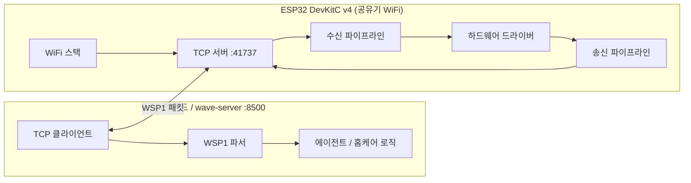
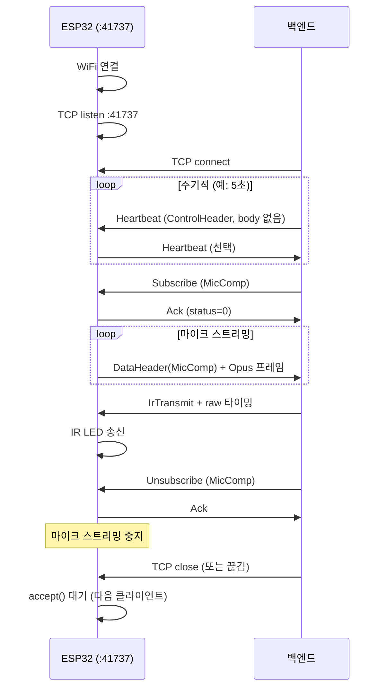
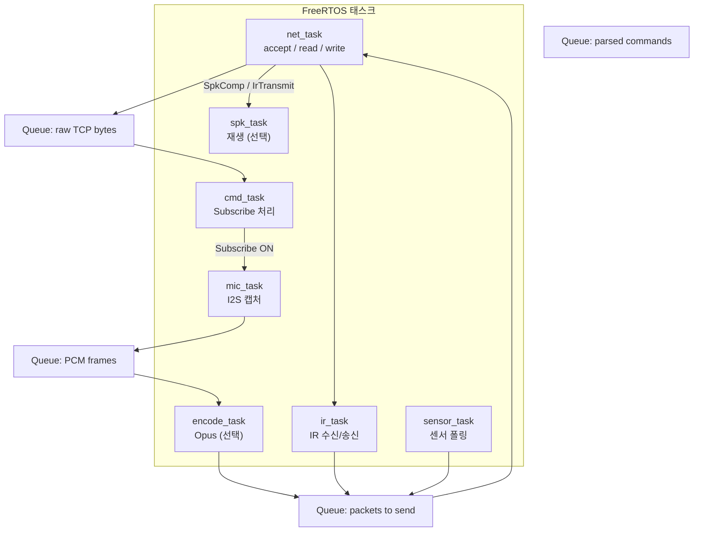
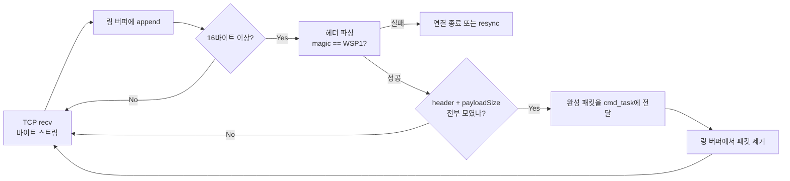
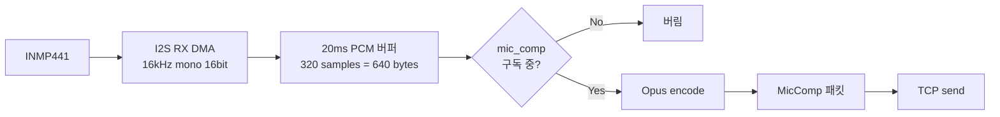
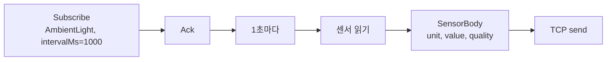
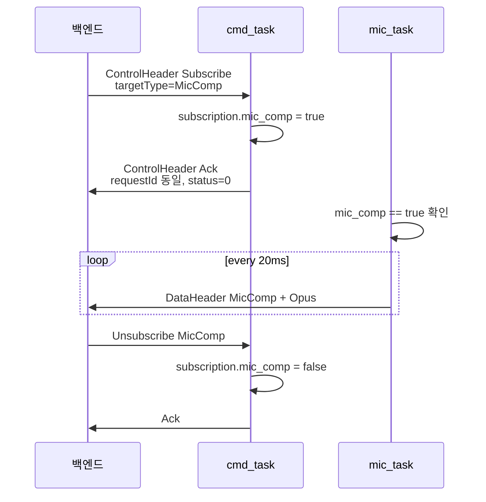

# WaveStation ESP32 구현 가이드

바이트 단위 필드 정의는 [wave-station-protocol.md](./wave-station-protocol.md)와 `src/wave-server/device/protocol/wave_station.h`를 참고하세요. 이 문서는 **무엇을 어떤 순서로 만들면 되는지**, **PC와 어떻게 대화하는지**, **ESP32 안에서 데이터가 어떻게 흐르는지**에 집중합니다.

---

## 0. 한 줄 요약

```
ESP32 = 공유기 WiFi 연결 → TCP 41737에서 서버(listen)
      → 백엔드가 접속하면 16바이트 헤더 + Body 패킷 주고받기
      → Subscribe 받으면 마이크/IR/센서 데이터를 보냄
      → 백엔드가 보낸 스피커/IR 명령을 실행
```

ESP32가 **서버**, PC가 **클라이언트**입니다. ESP32는 **41737** 포트에서 listen 하고, PC가 ESP32의 해당 포트에 접속합니다.

---

## 1. 먼저 이해해야 하는거

### 1.1 패킷 = 헤더 16바이트 + 내용

모든 메시지는 같은 모양입니다.

```
┌────────────────┬──────────────────────────────┐
│ Header (16 B)  │ Payload (payloadSize bytes)  │
└────────────────┴──────────────────────────────┘
```

헤더 종류는 두 가지뿐입니다.


| 헤더            | 쓰는 경우  | 예시                         |
| ------------- | ------ | -------------------------- |
| ControlHeader | 명령·응답  | Subscribe, Ack, Heartbeat  |
| DataHeader    | 실제 데이터 | MicComp, IrReceive, Sensor |


**TCP 1회 send = WSP1 패킷 1개**로 맞추면 파싱이 쉽습니다.

### 1.2 두 가지 통신 방식


| 방식           | 흐름                     | 의미                    |
| ------------ | ---------------------- | --------------------- |
| 제어 (Control) | PC ---> ESP32          | "마이크 보내줘" (Subscribe) |
| 데이터 (Data)   | ESP32 <--> C (스피커는 반대) | 실제 오디오·IR·센서 바이트      |


데이터를 보내기 전에, 백엔드가 **Subscribe**로 먼저 요청합니다. ESP32는 **Ack**로 "알겠다"고 답한 뒤 스트리밍을 시작합니다.

### 1.3 구현 우선순위 (추천)

한 번에 다 만들지 말고 단계를 나눕니다. 참고로 Heartbeat는 장치가 살아있는지 확인하는 패킷입니다.


| 단계  | 목표                                     | 확인 방법                        |
| --- | -------------------------------------- | ---------------------------- |
| 1   | WiFi + TCP listen + accept + Heartbeat | 백엔드에서 connect 후 Heartbeat 확인 |
| 2   | Subscribe / Ack                        | 백엔드가 MicComp 구독 → Ack 확인     |
| 3   | 마이크 PCM 전송 (MicPCM)                    | 백엔드에서 소리 파형 확인               |
| 4   | 마이크 Opus (MicComp)                     | 대역 절약 스트림                    |
| 5   | IR 수신 (IrReceive)                      | 리모컨 누르면 백엔드에 패킷 도착           |
| 6   | IR 송신 (IrTransmit)                     | 백엔드 명령으로 TV 켜기               |
| 7   | 스피커 (SpkComp)                          | 백엔드에서 TTS 재생                 |
| 8   | 센서                                     | 주기적으로 값 전송                   |


---


## 2. 전체 구조 (백엔드 ↔ ESP32)




역할 정리:

- **ESP32**: 공유기 WiFi 연결 → `0.0.0.0:41737` listen → 백엔드 접속 대기 → 명령 처리·데이터 송신.
- **백엔드**: `device_list` 등에 등록된 ESP32 LAN IP로 connect → Subscribe·TTS·IR 송신.

공유기에서 ESP32 MAC에 **DHCP 예약(고정 IP)** 을 걸어 두면 백엔드 설정이 안정적입니다.

---


## 3. 연결 수명 주기 (Lifecycle)




### 3.1 ESP32 메인 루프에서 할 일

```
부팅
  │
  ├─ GPIO / I2S / IR 초기화
  ├─ WiFi.begin(SSID, PASS)
  ├─ TCP server bind(0.0.0.0, 41737) + listen
  │
  └─ while (true)
        ├─ client = accept()          // 백엔드 접속 대기
        ├─ 구독 상태 초기화 (선택)
        └─ while (client 연결 유지)
              ├─ client에서 읽을 데이터 → 패킷 파싱 → 명령 큐
              ├─ Subscribe, IrTransmit, SpkComp 처리
              ├─ 마이크/IR/센서 패킷 → client로 send
              └─ (선택) Heartbeat 응답
        └─ client disconnect → 다시 accept()
```

연결이 끊기면 ESP32는 **다시 accept()만 하면 됩니다**. 재접속은 **백엔드**가 담당합니다 (지수 백오프: 1s → 2s → 4s … 최대 30s).

---


## 4. ESP32 내부 파이프라인 (권장 구조)

FreeRTOS 태스크로 나누면 블로킹이 줄어듭니다.




### 4.1 태스크별 역할


| 태스크         | 입력                            | 출력                    | 주기         |
| ----------- | ----------------------------- | --------------------- | ---------- |
| net_task    | TCP client socket (accept 결과) | 파싱된 패킷 / 송신 큐         | 이벤트驱动      |
| cmd_task    | ControlHeader 패킷              | 구독 플래그 변경, Ack 송신     | 이벤트        |
| mic_task    | I2S DMA                       | 20ms PCM 버퍼           | 20ms       |
| encode_task | PCM                           | Opus 프레임              | 20ms       |
| ir_task     | IR 수신 핀                       | IrReceive 패킷 / LED 송신 | 이벤트        |
| spk_task    | SpkComp 패킷                    | I2S DAC 출력            | 20ms       |
| sensor_task | I2C 센서                        | SensorBody 패킷         | intervalMs |


### 4.2 공유 상태 (간단한 플래그)

```cpp
struct SubscriptionState {
    bool mic_pcm;
    bool mic_comp;
    bool ambient_light;
    bool temperature;
    bool humidity;
    uint16_t sensor_interval_ms;
};
```

`Subscribe` 수신 시 해당 `targetType`을 true로, `Unsubscribe` 시 false로 바꿉니다.

---


## 5. TCP 수신 파이프라인 (백엔드 → ESP32)

백엔드(클라이언트)에서 오는 바이트를 패킷으로 만드는 과정입니다.




### 5.1 파싱 의사코드

```cpp
// ring buffer에 data가 쌓여 있다고 가정
while (ring.size() >= 16) {
    auto hdr = peek_header(ring);  // ControlHeader or DataHeader (둘 다 16B)
    if (hdr.magic != 0x57535031) { disconnect(); return; }
    if (hdr.version != 1) { send_error(...); continue; }

    size_t total = 16 + hdr.payloadSize;
    if (hdr.payloadSize > 4096) { disconnect(); return; }
    if (ring.size() < total) break;  // 더 recv 대기

    Packet pkt = ring.pop(total);
    dispatch(pkt);
}
```


### 5.2 dispatch: 타입별 처리


| type             | ESP32 동작           |
| ---------------- | ------------------ |
| Subscribe        | 구독 플래그 켜기 → Ack 송신 |
| Unsubscribe      | 구독 플래그 끄기 → Ack 송신 |
| Heartbeat        | 무시하거나 동일하게 응답      |
| SpkPCM / SpkComp | spk_task 큐에 넣기     |
| IrTransmit       | ir_task에 raw 배열 전달 |
| Error            | 로그 출력              |


---


## 6. TCP 송신 파이프라인 (ESP32 → 백엔드)


### 6.1 패킷 조립 예 (MicComp)

```
[ DataHeader 16B ]
[ AudioCompBody 9B ]  ← codec, sampleRate, encodedSize ...
[ encodedData N B ]
```

`payloadSize` = 9 + N (타임스탬프 안 쓸 때).

`sequence`는 **타입마다 따로** 0부터 증가시킵니다 (MicComp용, IrReceive용 각각).

### 6.2 송신 시 주의

- send 버퍼 하나에 헤더+바디를 **합쳐서** 한 번에 보냅니다.
- WiFi가 느릴 때 큐가 차면 **오래된 오디오 프레임을 버리는** 쪽이 실시간에 유리합니다 (최신 2~3프레임만 유지).

---


## 7. 기능별 파이프라인


### 7.1 마이크 (INMP441 → 백엔드)

하드웨어: INMP441은 **I2S**로 연결합니다.




권장 값 (백엔드와 맞출 것):


| 항목            | 값                   |
| ------------- | ------------------- |
| sampleRate    | 16000               |
| channels      | 1                   |
| bitsPerSample | 16                  |
| frame         | 320 samples / 20 ms |
| codec         | Opus                |


**MicPCM** 단계에서는 Opus 없이 PCM을 그대로 `AudioPCMBody` 뒤에 붙여내면 디버깅이 쉽습니다.

#### I2S 핀 (DevKitC v4 예시 — 팀에서 한 번 고정)


| 신호        | ESP32 핀 (예시) |
| --------- | ------------ |
| BCK       | GPIO 26      |
| WS (LRCK) | GPIO 25      |
| DATA IN   | GPIO 33      |


실제 핀은 배선에 맞게 문서화하고 바꾸지 않는 것이 좋습니다.

---


### 7.2 스피커 (백엔드 → ESP32 → 스피커)

스피커 모듈이 아직 없어도 **파이프라인만** 먼저 만들 수 있습니다 (I2S TX 또는 DAC).


백엔드가 보낸 `SpkComp`는 **Subscribe 없이** 바로 올 수 있습니다 (일회성 재생). 연속 스트리밍이면 백엔드에서 프레임을 꾸준히 보냅니다.

`HeaderFlag_KeyFrameBit`가 켜진 프레임이 오면 Opus 디코더를 리셋합니다.

---


### 7.3 IR 수신 (리모컨 → 백엔드)

라이브러리: **IRremoteESP8266** (ESP32에서도 사용 가능).


흐름:

1. IR 핀에서 신호 감지
2. 라이브러리가 mark/space 길이 배열 생성
3. tick이 아니라 **마이크로초(μs)** 로 변환
4. `IrReceiveBody.length` + `rawData[]` 를 패킷에 실어 백엔드로 전송

백엔드는 이 raw 배열로 에어컨/TV 프로토콜을 해석하거나 그대로 저장합니다.

---


### 7.4 IR 송신 (백엔드 → ESP32 → 가전)


`IrTransmitBody` 뒤의 `rawData`는 수신과 동일하게 **μs, mark부터 시작, mark/space 교대**입니다.

---


### 7.5 센서 (조도 / 온도 / 습도)

센서가 없어도 **가짜 값**으로 파이프라인을 검증할 수 있습니다.




`SubscribeOptionFlag_OnChangeOnlyBits`가 켜져 있으면 값이 변할 때만 보냅니다.

---


## 8. Subscribe / Ack 흐름 (가장 자주 쓰는 제어)




### SubscribeBody 해석


| 필드         | 마이크 예              | 센서 예                    |
| ---------- | ------------------ | ----------------------- |
| targetType | `0x0102` (MicComp) | `0x0301` (AmbientLight) |
| intervalMs | `0` (최대 속도)        | `1000` (1초마다)           |
| options    | `Compressed` 비트    | `OnChangeOnly` 선택       |


---


## 9. 공유기·네트워크 (ESP32 펌웨어)


| 항목        | 내용                                  |
| --------- | ----------------------------------- |
| WiFi      | 공유기 SSID/비밀번호로 STA 모드 접속            |
| ESP32 IP  | DHCP (공유기에서 MAC 기준 **고정 IP 예약** 권장) |
| listen 주소 | `0.0.0.0:41737`                     |
| 동시 접속     | v1은 **클라이언트 1개**만 accept (백엔드만 연결)  |


부팅 후 시리얼 로그에 `WiFi connected, IP=192.168.x.x, listening on 41737` 형태로 출력해 두면 현장 디버깅에 유리합니다.

---


## 10. 백엔드 개발자가 알아둘 것


| 항목         | 내용                                     |
| ---------- | -------------------------------------- |
| 연결 대상      | ESP32 LAN IP (예: `192.168.0.50`)       |
| 포트         | **41737** TCP (`wsp::kTcpPort`)        |
| 역할         | **클라이언트** — `connect(esp32_ip, 41737)` |
| 엔디안        | 전부 little-endian                       |
| Magic      | 수신 시 반드시 `WSP1` 검사                     |
| 최대 payload | 4096 bytes                             |
| 재접속        | 끊기면 백엔드가 재 connect                     |


테스트: `nc esp32_ip 41737` 로 TCP만 열리는지 확인 후, Subscribe 패킷을 보냅니다.

백엔드 API 연동은 [agent-tool-api.md](./agent-tool-api.md)의 **백엔드 → WaveStation** 절을 참고합니다.

---


## 11. ESP32 프로젝트 구성 (Arduino / ESP-IDF)


### 11.1 권장 디렉터리

```
wave-station-firmware/
  src/
    main.cpp
    net/
      tcp_server.cpp      # listen, accept, recv, send
      wsp_parser.cpp      # 헤더/바디 파싱
      wsp_builder.cpp     # 패킷 조립
    tasks/
      cmd_task.cpp
      mic_task.cpp
      ir_task.cpp
    hw/
      i2s_mic.cpp
      ir_driver.cpp
    wsp/
      wave_station.h      # PC와 동일 struct (복사)
  platformio.ini
```

`wave_station.h`는 PC 레포의 `src/wave-server/device/protocol/wave_station.h`와 **동일하게 유지**합니다.

### 11.2 필요 라이브러리 (예시)


| 기능         | 라이브러리                                          |
| ---------- | ---------------------------------------------- |
| WiFi / TCP | ESP-IDF `esp_wifi`, `lwip` 또는 Arduino `WiFi.h` |
| I2S 마이크    | ESP-IDF `driver/i2s`                           |
| IR         | IRremoteESP8266                                |
| Opus       | esp-opus 또는 libopus (나중 단계)                    |


### 11.3 메모리

- TCP 수신 링 버퍼: 8 KB 이상 권장
- Opus 프레임 버퍼: 1~2 KB
- IR raw: 최대 길이 상한을 두고 (예: 512개 uint16_t) 넘으면 overflow 플래그

---


## 12. 자주 하는 실수


| 증상             | 원인                         | 해결                                        |
| -------------- | -------------------------- | ----------------------------------------- |
| PC가 패킷을 못 읽음   | TCP에 헤더만 보내고 body를 따로 send | **한 번의 send**에 합치기                        |
| magic 불일치      | 엔디안 착각, 잘못된 offset         | `uint32_t`를 그대로 memcpy, `#pragma pack(1)` |
| 마이크가 안 옴       | Subscribe 전에 송신            | Subscribe + Ack 이후에만 Mic 송신               |
| 소리 깨짐          | sampleRate 불일치             | 16000 / mono / 16bit 통일                   |
| IR 재생 실패       | μs가 아닌 tick 그대로 전송         | μs로 변환 후 전송                               |
| 연결 자주 끊김       | Heartbeat 없음               | 백엔드가 5~10초마다 Heartbeat 송신                 |
| payloadSize 틀림 | 고정 body만 넣고 pcm/opus 길이 누락 | `payloadSize = body + 가변데이터`              |


---


## 13. 구현 체크리스트


### Step1: 연결

- [ ] WiFi 연결
- [ ] `0.0.0.0:41737` TCP listen + accept
- [ ] 백엔드에서 connect 성공
- [ ] Heartbeat 송수신
- [ ] 백엔드에서 magic/version 로그 확인


### Step2: 제어

- [ ] Subscribe / Ack 구현
- [ ] Unsubscribe / Ack
- [ ] requestId 매칭


### Step3: 마이크

- [ ] I2S로 20ms PCM 캡처
- [ ] MicPCM으로 백엔드에 전송
- [ ] Audacity 등으로 PCM 검증
- [ ] (선택) MicComp Opus


### Step4: IR / 스피커 / 센서

- [ ] IrReceive 한 번 백엔드에 도착
- [ ] IrTransmit으로 LED 깜빡임 확인
- [ ] SpkComp 재생
- [ ] 센서 Subscribe + 주기 전송

---


## 14. 관련 문서


| 문서                                                     | 용도                   |
| ------------------------------------------------------ | -------------------- |
| [wave-station-protocol.md](./wave-station-protocol.md) | 바이트 필드·hex 예시 (정본)   |
| [agent-tool-api.md](./agent-tool-api.md)               | 백엔드 ↔ WaveStation 연동 |
| `src/wave-server/device/protocol/wave_station.h`       | C++ struct 정의        |


질문이 생기면 **어느 파이프라인 단계에서 막혔는지** (연결 / Subscribe / 마이크 / IR)를 먼저 알려주면 원인 좁히기가 빠릅니다.

---


## 15. 변경 이력


| Version | Date       | Notes                          |
| ------- | ---------- | ------------------------------ |
| 1       | 2026-07-06 | ESP32 구현 가이드 초안                |
| 2       | 2026-07-06 | ESP32 TCP 서버 / 백엔드 클라이언트 역할 반영 |


